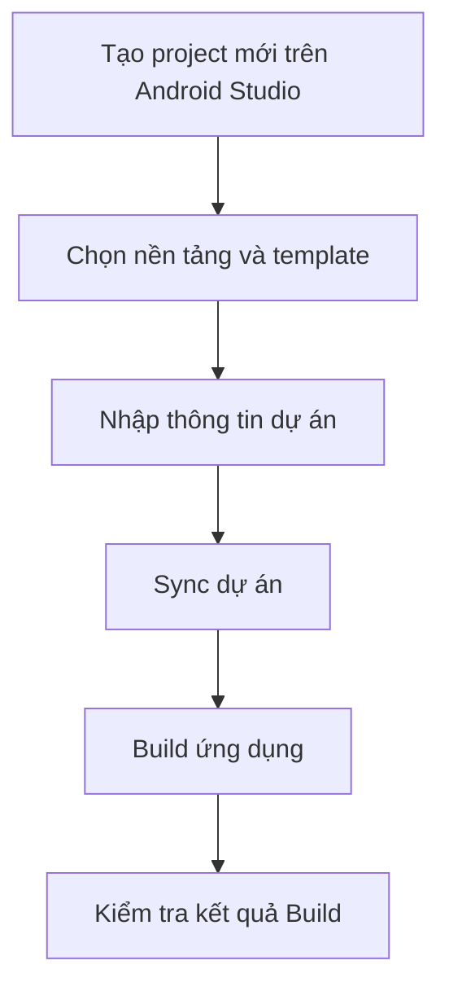

# Tạo project mới trên Android Studio

## Các khái niệm cơ bản khi tạo project mới trên Android Studio
Khi tạo project mới trên Android Studio, bạn sẽ được yêu cầu chọn một template cho ứng dụng của mình.
- **Platform**: Đây là nền tảng mà ứng dụng của bạn sẽ chạy, ví dụ như Android, Wear OS, TV, v.v. Việc chọn đúng nền tảng giúp bạn tối ưu hóa ứng dụng cho thiết bị mục tiêu.
- **Template**: template là một mẫu dự án đã được cấu hình sẵn với các thành phần cơ bản như Activity, Layout, và các file cần thiết khác. Việc chọn template giúp bạn tiết kiệm thời gian và công sức khi bắt đầu phát triển ứng dụng.
- **Activity**: Activity là một thành phần cơ bản của ứng dụng Android, đại diện cho một màn hình giao diện người dùng. Mỗi Activity có thể chứa các thành phần giao diện như nút bấm, văn bản, hình ảnh, v.v.

## Hướng dẫn chi tiết để tạo một project mới
1. Mở Android Studio và chọn "Start a new Android Studio project".
2. Chọn nền tảng mà bạn muốn phát triển ứng dụng, ví dụ như "Phone and Tablet".
3. Chọn một template phù hợp với nhu cầu của bạn, ví dụ như "Empty Activity" nếu bạn muốn bắt đầu từ một dự án trống.
4. Nhập tên ứng dụng, tên gói (package name), vị trí lưu trữ dự án, và các thông tin khác theo yêu cầu.
5. Nhấn "Finish" để tạo project mới. Android Studio sẽ tự động tạo cấu trúc dự án và các file cần thiết cho bạn.
Sau khi hoàn thành các bước trên, bạn sẽ có một project mới.

Một số khái niệm mà bạn cần hiểu khi tạo project mới trên Android Studio bao gồm:
- **Package Name**: Đây là tên duy nhất để xác định ứng dụng của bạn trên Google Play Store. Nó thường được viết theo định dạng "com.example.appname".
- **Minimum SDK**: Đây là phiên bản Android thấp nhất mà ứng dụng của bạn sẽ hỗ trợ. Việc chọn đúng Minimum SDK giúp bạn đảm bảo rằng ứng dụng của mình có thể chạy trên nhiều thiết bị khác nhau.
- **Target SDK**: Đây là phiên bản Android mà bạn muốn ứng dụng của mình tối ưu hóa. Việc chọn Target SDK giúp bạn tận dụng các tính năng mới nhất của Android và đảm bảo rằng ứng dụng của bạn hoạt động tốt trên các phiên bản Android mới nhất.
- **Build Configuration Language**: Đây là ngôn ngữ được sử dụng để cấu hình quá trình build của ứng dụng, ví dụ như Gradle. Việc hiểu và sử dụng đúng Build Configuration Language giúp bạn quản lý các phụ thuộc, cấu hình build, và tối ưu hóa quá trình phát triển ứng dụng của mình.
    - **Kotlin DSL**: Đây là một ngôn ngữ cấu hình build dựa trên Kotlin, cho phép bạn viết các script build một cách dễ dàng và trực quan hơn.
    - **Groovy DSL**: Đây là một ngôn ngữ cấu hình build dựa trên Groovy, được sử dụng phổ biến trong các dự án Android trước đây. Nó cung cấp một cách linh hoạt để cấu hình quá trình build của ứng dụng.
- **Gradle**: Đây là hệ thống build được sử dụng trong Android Studio để quản lý quá trình build của ứng dụng. Gradle giúp bạn tự động hóa quá trình build, quản lý các phụ thuộc, và tối ưu hóa hiệu suất của ứng dụng.

## Các thành phần cơ bản của một project Android
Khi bạn tạo một project mới trên Android Studio, bạn sẽ thấy một số thành phần cơ bản sau:
- **app**: Đây là module chính của ứng dụng, chứa mã nguồn, tài nguyên, và các file cấu hình cần thiết để xây dựng ứng dụng.
    - **src**: Đây là thư mục chứa mã nguồn của ứng dụng, bao gồm các file Java/Kotlin, các file XML cho giao diện người dùng, và các tài nguyên khác như hình ảnh, âm thanh, v.v.
    - **res**: Đây là thư mục chứa các tài nguyên của ứng dụng, bao gồm các file XML cho giao diện người dùng, các hình ảnh, các chuỗi văn bản, và các tài nguyên khác mà ứng dụng sử dụng.
    - **AndroidManifest.xml**: Đây là file cấu hình chính của ứng dụng, nơi bạn định nghĩa các thành phần của ứng dụng như Activity, Service, Broadcast Receiver, và các quyền truy cập mà ứng dụng yêu cầu.
- **build.gradle.kts**: Đây là các file cấu hình build sử dụng Kotlin DSL, nơi bạn có thể cấu hình các thiết lập build cho dự án của mình. Thông thường, bạn sẽ có các file build.gradle.kts:
    - **root build.gradle.kts**: Đây là file cấu hình build cấp độ dự án, nơi bạn có thể cấu hình các thiết lập chung cho toàn bộ dự án, như các plugin, các phụ thuộc chung, và các tác vụ build.
    - **module build.gradle.kts**: Đây là file cấu hình build cấp độ module, nơi bạn có thể cấu hình các thiết lập riêng cho module, như các phụ thuộc cụ thể, các tác vụ build riêng, và các thiết lập khác liên quan đến module đó.
- **gradle.properties**: Đây là file cấu hình nơi bạn có thể đặt các thuộc tính build, như các biến môi trường, các thiết lập tối ưu hóa, và các thông tin khác liên quan đến quá trình build của ứng dụng.
- **local.properties**: Đây là file cấu hình nơi bạn có thể đặt các thuộc tính liên quan đến môi trường phát triển của mình, như đường dẫn đến SDK Android, các thiết lập liên quan đến việc chạy ứng dụng trên thiết bị hoặc trình giả lập, và các thông tin khác liên quan đến môi trường phát triển của bạn.
- **settings.gradle.kts**: Đây là file cấu hình nơi bạn có thể định nghĩa các module trong dự án của mình, cũng như cấu hình các thiết lập liên quan đến việc quản lý các module và các phụ thuộc giữa chúng.
- **.idea**: Đây là thư mục chứa các file cấu hình của Android Studio, như các thiết lập dự án, các cấu hình run/debug, và các thông tin khác liên quan đến việc quản lý dự án trong Android Studio.
- **gradlew và gradlew.bat**: Đây là các file script để chạy Gradle trên các hệ điều hành khác nhau. gradlew được sử dụng trên hệ điều hành Unix/Linux/MacOS, trong khi gradlew.bat được sử dụng trên hệ điều hành Windows. Các file này giúp bạn chạy các tác vụ build của Gradle một cách dễ dàng và nhất quán trên các nền tảng khác nhau.

## Sync và Build thử ứng dụng
- **Sync**: Sau khi tạo project mới, bạn cần thực hiện quá trình Sync để Android Studio có thể tải về các phụ thuộc cần thiết và cấu hình dự án của bạn. Bạn có thể thực hiện Sync bằng cách nhấn vào nút "Sync Now" xuất hiện ở góc trên bên phải của Android Studio sau khi tạo project.
- **Build**: Sau khi Sync thành công, bạn có thể thực hiện quá trình Build để kiểm tra xem ứng dụng của bạn có thể được xây dựng thành công hay không. Bạn có thể thực hiện Build bằng cách nhấn vào nút "Build" trong thanh công cụ hoặc sử dụng phím tắt "Ctrl + F9" (Windows/Linux) hoặc "Cmd + F9" (MacOS). Nếu quá trình Build thành công, bạn sẽ thấy thông báo "Build successful" trong cửa sổ Build Output. Nếu có lỗi, bạn sẽ thấy thông báo lỗi và có thể kiểm tra chi tiết lỗi để sửa chữa.

## Tổng kết

