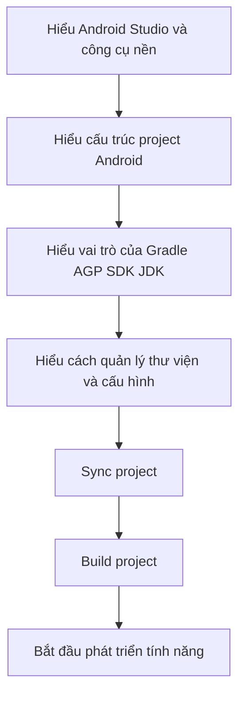

# Hiểu hạ tầng của một project Android

## Vì sao người mới nên hiểu phần hạ tầng trước khi lao vào code?
Khi mới bắt đầu học Android, nhiều người thường tập trung ngay vào việc viết Activity, tạo giao diện, gọi API, hoặc lưu dữ liệu. Điều đó không sai, nhưng nếu chỉ quan tâm đến code mà không hiểu phần hạ tầng của project, bạn sẽ rất dễ gặp các lỗi như:

- Không sync được project
- Build bị lỗi dù code không sai
- Không biết thêm thư viện ở đâu
- Không biết vì sao máy này build được nhưng máy khác lại lỗi
- Không rõ nên chọn JDK, SDK, Gradle, AGP như thế nào

Nói cách khác, code chỉ là phần nổi. Để viết code mượt mà, phần nền bên dưới phải rõ ràng và ổn định.

Bài viết này được viết cho người mới bắt đầu. Mục tiêu là giúp bạn hiểu một project Android được tổ chức và vận hành như thế nào, để khi tạo project mới hoặc mở project của người khác, bạn biết mình phải nhìn vào đâu và kiểm tra điều gì trước.

## Các khái niệm nền tảng cần hiểu trước

Trước khi nói đến file hay cấu trúc thư mục, bạn cần hiểu một số khái niệm cơ bản.

- **Android Studio**: Đây là môi trường phát triển chính thức cho Android. Nó giúp bạn tạo project, viết code, sync Gradle, quản lý SDK, chạy emulator, debug ứng dụng, và build APK/AAB.
- **Project Android**: Đây là toàn bộ tập hợp file, thư mục, cấu hình, mã nguồn, tài nguyên, và các thiết lập build để tạo ra một ứng dụng Android.
- **Module**: Một project Android có thể có một hoặc nhiều module. Module là đơn vị build độc lập. Module phổ biến nhất là `app`, ngoài ra còn có thể có các module thư viện như `core`, `feature`, `data`, `designsystem`.
- **SDK Android**: Đây là bộ công cụ và nền tảng Android mà project dùng để biên dịch và chạy. SDK bao gồm platform, build tools, platform-tools, emulator, command-line tools, và các thành phần liên quan khác.
- **JDK**: Đây là Java Development Kit. Gradle và nhiều công cụ Android cần JDK để chạy. Nếu chọn sai JDK, project có thể không sync hoặc không build được.
- **Gradle**: Đây là hệ thống build của Android. Gradle chịu trách nhiệm đọc cấu hình project, tải thư viện, chạy plugin, compile code, xử lý tài nguyên, và đóng gói ứng dụng.
- **Android Gradle Plugin (AGP)**: Đây là plugin giúp Gradle hiểu cách build ứng dụng Android. Không có AGP, Gradle chỉ là một build tool chung chung; AGP mới là phần thêm logic Android như xử lý `AndroidManifest.xml`, `res`, build variants, APK/AAB.
- **Gradle Wrapper**: Đây là bộ file `gradlew`, `gradlew.bat`, và thư mục `gradle/wrapper/`. Nó đảm bảo mọi máy đều dùng đúng phiên bản Gradle mà project yêu cầu.
- **Dependency**: Đây là các thư viện mà project sử dụng, ví dụ như Retrofit, Room, Hilt, Compose, Coroutines.
- **Sync**: Đây là quá trình Android Studio đọc các file Gradle, tải dependency, và chuẩn bị project để IDE hiểu cấu trúc và hỗ trợ code.
- **Build**: Đây là quá trình compile code, xử lý resources, tạo file APK hoặc AAB.

Nếu bạn nhớ được các khái niệm này, bạn sẽ dễ hiểu vì sao một project Android có nhiều file cấu hình đến vậy.

## Một project Android thường được quản lý như thế nào?

Một project Android không chỉ gồm mã nguồn, mà là một hệ thống gồm nhiều lớp quản lý khác nhau:

1. Android Studio quản lý môi trường làm việc và hỗ trợ phát triển.
2. Gradle quản lý quá trình build.
3. AGP quản lý phần build đặc thù của Android.
4. JDK cung cấp môi trường chạy cho Gradle và compiler.
5. Android SDK cung cấp nền tảng Android để compile và test.
6. Các file cấu hình trong project quyết định project có module nào, dùng thư viện nào, build theo kiểu nào.

Nói ngắn gọn:

- Android Studio là nơi bạn thao tác
- Gradle là nơi build
- AGP là nơi hiểu Android
- SDK là nơi cung cấp nền tảng Android
- JDK là nơi cung cấp runtime cho toolchain

Khi project gặp lỗi môi trường, lỗi thường không nằm ở code trước tiên mà nằm ở một trong những tầng này.

## Các file và thư mục quan trọng trong một project Android

Khi mở một project Android, bạn sẽ thường thấy các file và thư mục sau.

- **app/**: Đây là module chính của ứng dụng. Nó chứa mã nguồn, tài nguyên, manifest, và dependencies của app.
- **src/**: Đây là thư mục con trong module, dùng để chứa source code và test.
    - **main/**: Chứa code và tài nguyên chính của ứng dụng.
    - **test/**: Chứa unit test chạy trên JVM.
    - **androidTest/**: Chứa instrumentation test chạy trên emulator hoặc device.
- **res/**: Chứa tài nguyên như layout, string, color, drawable, theme.
- **AndroidManifest.xml**: Đây là file khai báo các thành phần chính của ứng dụng như Activity, Service, Receiver, permission, intent filter.
- **build.gradle.kts**: Đây là file cấu hình build bằng Kotlin DSL.
    - **root build.gradle.kts**: Quản lý plugin hoặc cấu hình chung cho toàn project.
    - **module build.gradle.kts**: Quản lý build của từng module cụ thể.
- **settings.gradle.kts**: Đây là nơi khai báo các module trong project và cấu hình nơi lấy plugin hoặc dependency.
- **gradle.properties**: Đây là nơi đặt các thuộc tính build chung của project, ví dụ JVM args, configuration cache, AndroidX flags.
- **local.properties**: Đây là file dành cho máy local, thường chứa đường dẫn tới Android SDK. File này không nên commit lên Git.
- **gradle/**: Đây là thư mục chứa dữ liệu của Gradle Wrapper và đôi khi chứa version catalog.
- **gradlew và gradlew.bat**: Đây là các script dùng để chạy Gradle đúng phiên bản của project trên macOS/Linux và Windows.
- **build/**: Đây là thư mục tự sinh trong quá trình build. Không nên chỉnh sửa thủ công.

Điều quan trọng nhất mà người mới cần nhớ là không phải file nào cũng nên sửa.

- Bạn có thể chủ động sửa `build.gradle.kts`, `settings.gradle.kts`, `gradle.properties`, mã nguồn, tài nguyên.
- Bạn không nên sửa `build/` hoặc các file sinh tự động.
- Bạn không nên commit `local.properties` vì đó là cấu hình riêng của máy bạn.

## Vai trò của từng file cấu hình quan trọng

Đây là phần rất quan trọng vì nhiều người mới nhìn thấy nhiều file Gradle và không biết file nào dùng để làm gì.

### `settings.gradle.kts`
File này dùng để trả lời hai câu hỏi:

1. Project này có những module nào?
2. Project này lấy plugin và dependency từ những repository nào?

Ví dụ, nếu project có module `app` và `core`, file này sẽ khai báo để Gradle biết phải load cả hai module.

### `build.gradle.kts` ở cấp project
File này thường dùng để khai báo plugin chung cho toàn project. Nó không phải nơi để bạn nhét tất cả dependency của app vào.

Bạn có thể hiểu file này là nơi quản lý phần build ở mức tổng quát.

### `build.gradle.kts` ở cấp module
Đây là file quan trọng nhất đối với từng module. Nó quyết định:

- Module này là app hay library
- `compileSdk`, `minSdk`, `targetSdk`
- `applicationId`
- `buildTypes`
- `productFlavors`
- `dependencies`
- Các tính năng build như Compose, BuildConfig, viewBinding, v.v.

Nếu bạn muốn thêm thư viện cho app, phần lớn thời gian bạn sẽ làm trong file này.

### `gradle.properties`
File này dùng để đặt các cờ cấu hình chung cho project. Ví dụ:

- Tăng bộ nhớ cho Gradle daemon
- Bật configuration cache
- Bật AndroidX
- Bật hoặc tắt một số compatibility flag

Đây là file dành cho cấu hình build chung, không phải nơi đặt SDK path cá nhân.

### `local.properties`
File này thường chứa thông tin local của máy, đặc biệt là đường dẫn Android SDK.

Ví dụ:

```properties
sdk.dir=C\:\Users\your-name\AppData\Local\Android\Sdk
```

Người mới thường hay phạm sai lầm là commit file này lên Git. Điều đó không nên, vì mỗi máy có đường dẫn SDK khác nhau.

## Thư viện trong Android project được quản lý ra sao?

Đây là câu hỏi rất quan trọng, vì một project Android gần như luôn dùng nhiều thư viện ngoài.

### Dependency là gì?
Dependency là thư viện mà project của bạn cần để hoạt động. Ví dụ:

- Retrofit để gọi API
- Room để lưu dữ liệu cục bộ
- Hilt để dependency injection
- Coroutines để xử lý bất đồng bộ
- Compose hoặc Material để xây dựng giao diện

### Thêm thư viện ở đâu?
Thông thường bạn sẽ thêm thư viện vào `dependencies` trong file `build.gradle.kts` của module.

Ví dụ:

```kotlin
dependencies {
    implementation("com.squareup.retrofit2:retrofit:2.11.0")
}
```

Tuy nhiên, với project hiện đại, bạn không nên hardcode version như vậy ở nhiều nơi.

### Version catalog là gì?
Version catalog là cách quản lý versions và thư viện tập trung, thường nằm trong file `gradle/libs.versions.toml`.

Lợi ích:

- Dễ theo dõi version của toàn project
- Giảm việc viết lặp lại
- Dễ nâng cấp thư viện hơn
- Giảm nguy cơ một thư viện bị dùng nhiều version khác nhau

Với người mới bắt đầu, lời khuyên tốt là:

- Nếu project mới và đơn giản, bạn vẫn nên tập làm quen với version catalog từ đầu
- Đừng để version nằm rải rác trong nhiều file nếu bạn muốn project bền lâu

### Các scope dependency phổ biến
Khi thêm thư viện, bạn sẽ gặp các từ như:

- **implementation**: Thư viện dùng trong module hiện tại
- **api**: Dùng khi module là library và bạn muốn lộ thư viện đó cho module khác phụ thuộc vào nó
- **testImplementation**: Chỉ dùng cho unit test
- **androidTestImplementation**: Chỉ dùng cho instrumentation test
- **debugImplementation**: Chỉ dùng khi build debug

Người mới thường chỉ cần nhớ:

- Dùng `implementation` cho phần lớn thư viện bình thường
- Dùng `testImplementation` cho thư viện test
- Dùng `androidTestImplementation` cho test chạy trên thiết bị

### Khi nào nên tách thư viện nội bộ thành module?
Khi project bắt đầu lớn, bạn có thể tách code thành nhiều module để quản lý tốt hơn.

Ví dụ:

- `app`: module ứng dụng chính
- `core`: phần dùng chung
- `feature-home`: tính năng trang chủ
- `feature-settings`: tính năng cài đặt

Việc tách module giúp:

- Dễ quản lý code hơn
- Dễ test hơn
- Dễ tái sử dụng hơn
- Dễ kiểm soát dependencies hơn

Tuy nhiên, người mới không cần tách module quá sớm. Hãy bắt đầu đơn giản, rồi tách khi project đủ lớn để cần điều đó.

## Project Android được build như thế nào?

Nhiều người nhấn nút Build nhưng không biết bên dưới chuyện gì đang xảy ra. Thực tế, luồng build cơ bản như sau:

1. Android Studio hoặc terminal gọi Gradle Wrapper.
2. Wrapper đảm bảo đúng phiên bản Gradle của project được sử dụng.
3. Gradle đọc `settings.gradle.kts` để biết project có những module nào.
4. Gradle đọc các file `build.gradle.kts` để biết plugin, dependencies, SDK versions, build types.
5. AGP xử lý `AndroidManifest.xml`, tài nguyên trong `res/`, và các source set.
6. Kotlin/Java compiler biên dịch mã nguồn.
7. Android build tools đóng gói ứng dụng thành APK hoặc AAB.
8. Nếu build release, các bước tối ưu như shrink hoặc obfuscate có thể được áp dụng.

Nếu hiểu flow này, bạn sẽ biết lỗi đang xảy ra ở đâu:

- Lỗi lúc resolve plugin thường ở tầng Gradle hoặc plugin
- Lỗi lúc compile thường ở code hoặc dependency
- Lỗi resource linking thường ở `res/`, theme, manifest, hoặc thư viện UI

## Sync khác gì Build?

Đây là chỗ rất nhiều người mới hay nhầm.

- **Sync**: Android Studio đọc cấu hình Gradle, tải dependencies, và chuẩn bị project cho IDE. Sync giúp IDE hiểu code, hiểu module, và hỗ trợ autocomplete, navigation, indexing.
- **Build**: Build là quá trình thật sự biên dịch project để tạo ra output như APK hoặc AAB.

Bạn có thể hiểu đơn giản:

- Sync là chuẩn bị môi trường của project trong IDE
- Build là tạo ra sản phẩm chạy được

Một project có thể sync lỗi trước khi build. Cũng có thể sync được nhưng build vẫn lỗi do code, resource, test, signing, hoặc cấu hình release.

## Quản lý cấu hình sao cho thông minh?

Người mới thường hay để mọi thứ vào một chỗ, nhưng project tốt là project biết phân loại cấu hình đúng nơi.

### Cấu hình dùng chung cho team
Những gì mọi người trong team đều cần giống nhau nên nằm trong project, ví dụ:

- Gradle Wrapper version
- AGP version
- Kotlin version
- Danh sách repositories
- Các flags build chung
- Danh sách module

### Cấu hình chỉ dành cho máy local
Những thứ chỉ liên quan tới máy của bạn nên để local, ví dụ:

- Đường dẫn SDK Android
- Một số biến môi trường chỉ phục vụ phát triển cá nhân
- Signing file hoặc local secret dùng cho debug nội bộ

### Cấu hình theo môi trường
Khi project có nhiều môi trường như dev, staging, prod, bạn nên quản lý rõ bằng:

- `buildTypes`
- `productFlavors`
- `BuildConfig`
- resource values theo variant

Ví dụ:

- Môi trường dev dùng API dev
- Môi trường prod dùng API thật
- Debug có thể bật log nhiều hơn release

Điều quan trọng là phải phân biệt:

- Cái gì là cấu hình môi trường
- Cái gì là bí mật thật sự

Không nên hardcode API key thật vào source code nếu ứng dụng phát hành cho người dùng cuối.

## Chọn đúng SDK, JDK, AGP, Gradle như thế nào?

Đây là phần quan trọng nhất để tránh lỗi môi trường.

### 1. Chọn Android Studio bản ổn định
Nếu bạn là người mới, hãy ưu tiên bản stable. Đừng dùng canary hoặc preview nếu chưa có lý do rõ ràng.

### 2. Dùng Gradle Wrapper của project
Đừng phụ thuộc vào bản Gradle cài sẵn trong máy. Hãy luôn build bằng `gradlew` hoặc `gradlew.bat`.

### 3. Kiểm tra JDK trước khi build
Gradle cần JDK để chạy. Nếu JDK không phù hợp, project có thể không sync được hoặc báo lỗi rất khó hiểu.

Lời khuyên an toàn cho người mới:

- Dùng JDK mà Android Studio khuyến nghị hoặc JBR đi kèm Android Studio
- Nếu build bằng terminal, kiểm tra `JAVA_HOME` khi cần
- Khi project báo lỗi liên quan tới JVM hoặc Java, hãy kiểm tra JDK trước khi đụng tới code

### 4. Hiểu `compileSdk`, `targetSdk`, `minSdk`
- **compileSdk**: Phiên bản Android SDK mà project dùng để biên dịch. Máy của bạn phải cài đúng platform tương ứng.
- **targetSdk**: Phiên bản Android mà ứng dụng tuyên bố đã tối ưu hành vi cho nó.
- **minSdk**: Phiên bản Android thấp nhất mà ứng dụng hỗ trợ.

Người mới thường hay nhầm rằng `minSdk` càng cao thì build càng dễ. Điều này không hoàn toàn đúng. `minSdk` là quyết định về phạm vi thiết bị hỗ trợ, không phải là giải pháp cho lỗi môi trường.

### 5. Kiểm tra compatibility giữa AGP, Gradle, Kotlin và plugin khác
Đây là điểm dễ gây lỗi nhất.

Ví dụ, nếu bạn nâng Kotlin, bạn có thể phải kiểm tra lại:

- Compose Compiler plugin
- KSP version
- AGP compatibility
- Một số DSL cũ còn hỗ trợ hay không

Nguyên tắc an toàn là:

- Nâng version từng nhóm nhỏ
- Đọc release notes khi nâng major version
- Sau khi nâng, phải sync và build thử ngay

## Những lỗi môi trường người mới hay gặp

### Không tìm thấy Android SDK
Nguyên nhân thường gặp:

- Chưa cài SDK
- `local.properties` sai đường dẫn
- Android Studio chưa nhận đúng SDK location

### Gradle sync fail
Nguyên nhân thường gặp:

- Sai version plugin
- Mất mạng hoặc repository không resolve được
- JDK không phù hợp
- Có dependency hoặc plugin không tồn tại

### Build fail dù code nhìn có vẻ đúng
Nguyên nhân thường gặp:

- Thiếu dependency
- Thiếu SDK platform tương ứng `compileSdk`
- Resource hoặc theme chưa đủ
- KSP, Kotlin, AGP không tương thích với nhau

### Máy mình chạy được, máy khác không chạy được
Nguyên nhân thường gặp:

- Mỗi máy dùng JDK khác nhau
- Một người build bằng wrapper, người khác dùng Gradle hệ thống
- Có file local bị commit nhầm hoặc thiếu file môi trường
- Android SDK cài trên mỗi máy không giống nhau

## Checklist an toàn khi tạo hoặc mở một project Android

Nếu bạn là người mới, hãy tập thói quen kiểm tra theo thứ tự này.

1. Kiểm tra Android Studio đã cài bản ổn định chưa.
2. Kiểm tra Android SDK đã được cài chưa.
3. Kiểm tra JDK mà Android Studio hoặc Gradle đang dùng.
4. Kiểm tra project có `gradlew` hoặc `gradlew.bat` không.
5. Kiểm tra `settings.gradle.kts` để biết project có bao nhiêu module.
6. Kiểm tra `build.gradle.kts` của module `app` để biết `compileSdk`, `minSdk`, `targetSdk`, dependencies.
7. Kiểm tra `gradle.properties` xem có cờ build đặc biệt nào không.
8. Sync project trước.
9. Build thử ngay sau khi sync.
10. Chỉ bắt đầu code nhiều sau khi project build ổn định.

## Một cách học đúng cho người mới bắt đầu

Nếu bạn muốn học Android bài bản và ít bị rối, hãy đi theo thứ tự sau:

1. Hiểu cách tạo project mới.
2. Hiểu cấu trúc thư mục và vai trò từng file.
3. Hiểu Gradle, AGP, SDK, JDK ở mức khái niệm.
4. Hiểu cách thêm dependency và cách build project.
5. Hiểu cách debug lỗi môi trường trước khi debug business logic.
6. Sau đó mới đi sâu vào UI, networking, database, architecture.

Đi theo thứ tự này sẽ giúp bạn bớt cảm giác Android quá phức tạp, vì bạn đang hiểu dần từ nền móng lên thay vì nhìn mọi thứ cùng lúc.

## Tổng kết

Bạn không cần nhớ ngay tất cả tên file, version, hay plugin. Điều quan trọng hơn là hiểu mô hình vận hành chung:

- Android Studio là môi trường làm việc
- Gradle là hệ thống build
- AGP là phần mở rộng để build Android
- SDK là nền tảng Android để compile và chạy
- JDK là runtime cho toolchain
- Các file cấu hình quyết định project được build như thế nào
- Dependency và version cần được quản lý có tổ chức

Khi nắm được các ý này, bạn sẽ bớt sợ project Android và biết phải bắt đầu kiểm tra từ đâu mỗi khi có lỗi xảy ra.

