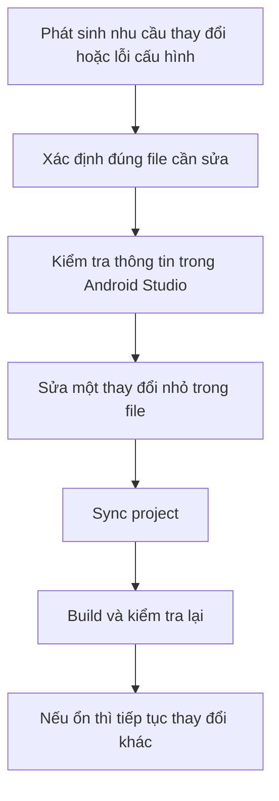

# Cách kiểm tra và sửa các file cấu hình quan trọng trong project Android

## Vì sao người mới thường bị khựng khi đụng tới file cấu hình?
Nhiều người mới học Android có thể đọc Kotlin khá ổn, viết Activity hoặc Composable cũng không quá khó, nhưng khi phải sửa các file như `build.gradle.kts`, `gradle.properties`, `local.properties`, `settings.gradle.kts`, hoặc `AndroidManifest.xml` thì lại bị chậm lại rất nhiều.

Lý do rất đơn giản:

- File cấu hình không giống code business thông thường
- Một thay đổi nhỏ có thể làm cả project không sync được
- Có nhiều file giống nhau về tên nhưng khác vai trò
- Android Studio hỗ trợ rất nhiều chỗ để xem thông tin, nhưng không phải chỗ nào cũng nên dùng để sửa

Vì vậy, người mới rất cần một bài hướng dẫn riêng cho phần này.

Bài viết này được viết như một cẩm nang thao tác. Mục tiêu là giúp bạn biết:

- Mỗi file cấu hình quan trọng dùng để làm gì
- Khi nào cần kiểm tra hoặc chỉnh sửa nó
- Sửa xong thì kiểm tra lại bằng cách nào
- Dùng Android Studio ở đâu để quan sát thông tin liên quan
- Tránh những lỗi phổ biến khi đụng vào cấu hình project

## Tư duy đúng trước khi sửa file cấu hình

Trước khi đi vào từng file, bạn nên có một nguyên tắc làm việc an toàn. Đây là điểm rất quan trọng.

### 1. Luôn xác định đúng file cần sửa
Không phải lỗi nào liên quan tới build cũng nên sửa trong `build.gradle.kts`. Ví dụ:

- Lỗi SDK path thường liên quan `local.properties` hoặc SDK Manager
- Lỗi thêm module thường liên quan `settings.gradle.kts`
- Lỗi permission hoặc component thường liên quan `AndroidManifest.xml`
- Lỗi memory của Gradle hoặc compatibility flags thường liên quan `gradle.properties`

Nếu sửa sai file, bạn vừa mất thời gian vừa dễ làm project rối hơn.

### 2. Sửa từng bước nhỏ, không sửa một lúc quá nhiều thứ
Người mới thường có xu hướng sửa nhiều dòng cùng lúc vì nghĩ rằng “nhân tiện sửa luôn”. Đây là thói quen không tốt.

Cách an toàn hơn là:

1. Xác định lỗi hoặc nhu cầu thay đổi
2. Sửa một chỗ nhỏ
3. Sync project
4. Build thử
5. Nếu ổn mới đi tiếp

Làm như vậy giúp bạn biết chính xác thay đổi nào gây ra lỗi.

### 3. Dùng Git như một lưới an toàn
File cấu hình rất dễ làm project gãy. Vì vậy, trước khi sửa những phần quan trọng, bạn nên có commit hoặc ít nhất là biết mình đã thay đổi gì.

Người mới không cần quá phức tạp, chỉ cần nhớ:

- Trước khi sửa nhiều cấu hình, nên commit trạng thái đang chạy được
- Sau khi sửa, xem lại diff để biết mình đã động vào đâu

### 4. Android Studio là nơi kiểm tra rất tốt, nhưng file mới là nguồn sự thật
Android Studio có nhiều màn hình hiển thị thông tin như:

- Project Structure
- SDK Manager
- Build Variants
- Merged Manifest
- Gradle tool window

Những màn hình này rất hữu ích để quan sát và kiểm tra. Tuy nhiên, trong phần lớn trường hợp, file cấu hình trong project mới là thứ bạn nên tin và chỉnh trực tiếp. Nói cách khác:

- Android Studio UI rất tốt để kiểm tra
- File cấu hình rất tốt để quản lý thay đổi một cách rõ ràng và bền vững

## Trước khi sửa file, nên kiểm tra gì trong Android Studio?

Người mới thường mở file ra sửa ngay. Cách tốt hơn là kiểm tra thông tin xung quanh trước.

## Mở đúng file nhanh nhất

Bạn có thể dùng các cách sau trong Android Studio:

- Nhấn `Shift` hai lần để tìm file bằng Search Everywhere
- Dùng cửa sổ Project và chuyển giữa chế độ `Android` và `Project`
- Dùng `Ctrl + Shift + N` trên Windows hoặc Linux để tìm file theo tên

Chế độ `Android` dễ nhìn với người mới vì nó gom các phần Android theo logic IDE. Chế độ `Project` lại phù hợp hơn khi bạn muốn thấy đúng cấu trúc file thật trên ổ đĩa.

## Kiểm tra SDK bằng SDK Manager

Khi nghi ngờ vấn đề liên quan SDK, hãy mở:

- `Tools > SDK Manager`

Ở đây bạn có thể kiểm tra:

- Đã cài SDK Platform tương ứng với `compileSdk` chưa
- Đã cài Platform-Tools chưa
- Đã cài Command-line Tools chưa
- Đã cài Emulator và system image chưa

Nếu project yêu cầu một Android platform mà máy bạn chưa cài, sync hoặc build có thể fail ngay cả khi code đúng.

## Kiểm tra JDK và thiết lập Gradle bằng Android Studio

Khi nghi ngờ lỗi liên quan Java hoặc Gradle, hãy kiểm tra:

- `File > Settings > Build, Execution, Deployment > Build Tools > Gradle`

Tại đây bạn thường sẽ thấy Gradle JDK mà Android Studio đang dùng.

Người mới nên nhớ:

- Nếu terminal build lỗi vì Java, chưa chắc Android Studio cũng đang lỗi giống vậy
- Android Studio có thể dùng một JDK riêng
- Terminal có thể dùng `JAVA_HOME` hoặc PATH khác

Vì vậy, khi gặp lỗi Java, hãy phân biệt rõ:

- Android Studio đang dùng JDK nào
- Terminal đang dùng JDK nào

## Kiểm tra module và dependency bằng Project Structure

Bạn có thể mở:

- `File > Project Structure`

Màn hình này giúp bạn quan sát:

- Project SDK và SDK location
- Danh sách module
- Dependencies của từng module
- Build variants và một số thông tin build khác

Đây là nơi rất tốt để xem thông tin tổng quát. Nhưng với dự án hiện đại, đặc biệt là dự án dùng Kotlin DSL và version catalog, bạn vẫn nên chỉnh trực tiếp trong file để thay đổi được rõ ràng và có thể review bằng Git.

## Kiểm tra Manifest bằng Merged Manifest

Khi mở `AndroidManifest.xml`, Android Studio thường cho bạn xem tab `Merged Manifest`.

Đây là một tính năng rất quan trọng vì manifest cuối cùng của app không chỉ đến từ manifest của chính module `app`, mà còn có thể được merge từ:

- Thư viện phụ thuộc
- Build type
- Product flavor
- Manifest placeholders

Nếu bạn thấy app có permission hoặc component lạ, hoặc manifest của bạn dường như không có tác dụng, hãy kiểm tra `Merged Manifest` trước.

## Kiểm tra biến thể build bằng Build Variants

Khi project có `debug`, `release`, hoặc nhiều flavor như `dev`, `staging`, `prod`, bạn nên mở cửa sổ:

- `Build > Select Build Variant`
hoặc tool window `Build Variants`

Điều này giúp bạn biết mình đang build biến thể nào. Rất nhiều lỗi “sao cấu hình không ăn” đến từ việc bạn đang xem nhầm variant.

## Kiểm tra lỗi bằng Build Output, Problems và Terminal

Khi sửa file cấu hình xong, bạn nên quan sát ở ba nơi:

- `Build Output` để xem log build chi tiết
- `Problems` để xem lỗi được IDE gom lại
- `Terminal` để chạy trực tiếp lệnh Gradle nếu cần xác nhận rõ hơn

Một vài lệnh rất hữu ích:

```powershell
gradlew.bat -version
gradlew.bat tasks
gradlew.bat assembleDebug
gradlew.bat test
gradlew.bat lint
```

Nếu bạn dùng macOS hoặc Linux, thay `gradlew.bat` bằng `./gradlew`.

## Hướng dẫn chi tiết từng file cấu hình quan trọng

Phần dưới đây là trọng tâm của bài viết.

## `build.gradle.kts` ở cấp project

### File này dùng để làm gì?
Đây là file build ở cấp project, thường nằm ở thư mục gốc. Nó thường dùng để khai báo plugin chung hoặc một số thiết lập build áp dụng cho toàn bộ project.

Trong nhiều project hiện đại, file này khá ngắn. Điều đó là bình thường.

### Khi nào bạn cần sửa file này?
Bạn sẽ đụng tới file này khi:

- Thêm hoặc đổi plugin dùng chung cho project
- Khai báo plugin alias ở mức root với `apply false`
- Điều chỉnh một số cấu hình build tổng quát ở mức project

### Thường sửa những gì?
Thường là phần `plugins {}`.

Ví dụ:

```kotlin
plugins {
    alias(libs.plugins.android.application) apply false
    alias(libs.plugins.kotlin.android) apply false
    alias(libs.plugins.ksp) apply false
}
```

Ý nghĩa của `apply false` là plugin được khai báo sẵn ở cấp project, nhưng chưa áp dụng ngay tại đây. Sau đó các module con sẽ chọn dùng plugin nào.

### Khi nào không nên sửa file này?
Bạn không nên thêm dependency của riêng module app vào file này. Ví dụ thêm Retrofit hoặc Room của app vào đây là sai chỗ.

### Sửa xong thì kiểm tra gì?

1. Sync project
2. Kiểm tra plugin có resolve được không
3. Build thử module chính

### Lỗi thường gặp

- Khai báo plugin sai version
- Dùng alias chưa tồn tại trong version catalog
- Apply plugin ở sai nơi, gây conflict

## `build.gradle.kts` ở cấp module

### File này dùng để làm gì?
Đây là file cấu hình quan trọng nhất của từng module. Với người mới, file bạn gặp nhiều nhất là `app/build.gradle.kts`.

File này quyết định:

- Module là ứng dụng hay thư viện
- `namespace`
- `applicationId`
- `compileSdk`, `minSdk`, `targetSdk`
- `buildTypes`
- `productFlavors`
- `buildFeatures`
- `dependencies`

### Khi nào bạn cần sửa file này?
Bạn sẽ sửa file này khi:

- Thêm thư viện mới
- Bật Compose hoặc viewBinding
- Đổi `minSdk`, `targetSdk`, `compileSdk`
- Thêm build type hoặc flavor
- Thêm `applicationIdSuffix` hoặc `versionNameSuffix`
- Cấu hình test, signing, packaging, ProGuard, BuildConfig

### Những khái niệm người mới cần phân biệt rõ

#### `namespace`
Đây là package namespace dùng cho mã nguồn và resource generation ở thời Android hiện đại.

#### `applicationId`
Đây là danh tính cài đặt của ứng dụng trên thiết bị và thường là ID dùng khi phát hành.

Người mới hay nhầm hai khái niệm này giống nhau. Trong nhiều project chúng có thể trông giống nhau, nhưng về vai trò thì không hoàn toàn giống.

#### `compileSdk`
Đây là phiên bản Android SDK mà project dùng để biên dịch.

#### `minSdk`
Đây là phiên bản Android thấp nhất app hỗ trợ.

#### `targetSdk`
Đây là phiên bản Android mà app tuyên bố đã tối ưu hành vi cho nó.

### Ví dụ những thay đổi thường gặp

#### Thêm thư viện

```kotlin
dependencies {
    implementation(libs.retrofit)
}
```

Nếu project dùng version catalog, bạn thường phải thêm hoặc sửa alias trong `gradle/libs.versions.toml` trước, rồi mới dùng alias đó ở đây.

#### Bật Compose

```kotlin
android {
    buildFeatures {
        compose = true
    }
}
```

#### Thêm build type

```kotlin
android {
    buildTypes {
        getByName("debug") {
            applicationIdSuffix = ".debug"
            versionNameSuffix = "-debug"
        }
    }
}
```

### Sửa file này theo quy trình nào cho an toàn?

1. Xác định rõ bạn cần đổi dependency, SDK, build type hay feature nào
2. Sửa một phần nhỏ
3. Sync project
4. Nếu sync ổn, chạy `assembleDebug`
5. Nếu thay đổi liên quan test hoặc variant, chạy thêm task tương ứng

### Lỗi thường gặp

- Thêm dependency sai scope
- Dùng alias không tồn tại
- Đổi `compileSdk` nhưng quên cài SDK platform tương ứng
- Lẫn lộn giữa `namespace` và `applicationId`
- Viết DSL sai cú pháp Kotlin DSL

## `gradle.properties`

### File này dùng để làm gì?
Đây là file chứa các thuộc tính Gradle hoặc Android build áp dụng chung cho project.

Ví dụ thường gặp:

```properties
org.gradle.jvmargs=-Xmx2048m -Dfile.encoding=UTF-8
org.gradle.configuration-cache=true
android.useAndroidX=true
```

### Khi nào bạn cần sửa file này?
Bạn sẽ chỉnh file này khi:

- Muốn tăng bộ nhớ cho Gradle daemon
- Muốn bật hoặc tắt configuration cache
- Muốn bật một cờ compatibility của AGP hoặc Kotlin
- Muốn thêm một số thuộc tính build dùng chung cho project

### Khi nào không nên dùng file này?
Bạn không nên xem đây là nơi để đặt mọi thứ. Ví dụ:

- Không nên để `sdk.dir` ở đây
- Không nên commit secret nhạy cảm vào đây nếu file được theo dõi bởi Git
- Không nên dùng file này để thay thế hoàn toàn cho cấu hình theo environment

### Cách kiểm tra trong Android Studio
Khi nghi ngờ thay đổi trong `gradle.properties` có tác động, bạn nên:

1. Sync lại project
2. Xem Build Output
3. Nếu liên quan tới hiệu năng hoặc cache, thử build lại từ terminal

### Lỗi thường gặp

- Thêm property sai tên nên không có tác dụng
- Dùng property cũ đã bị deprecated
- Dùng file này cho thông tin chỉ thuộc máy local

## `local.properties`

### File này dùng để làm gì?
Đây là file dành riêng cho máy của bạn. Vai trò phổ biến nhất là chỉ đường dẫn tới Android SDK.

Ví dụ:

```properties
sdk.dir=C\:\Users\your-name\AppData\Local\Android\Sdk
```

### Khi nào bạn cần sửa file này?
Bạn thường chỉ cần sửa khi:

- Di chuyển vị trí cài Android SDK
- Mở project trên máy mới
- Android Studio chưa tự nhận đúng SDK location

### Khi nào không nên sửa file này?
Bạn không nên dùng `local.properties` làm nơi chia sẻ cấu hình chung cho team.

Bạn cũng không nên commit file này, vì:

- Mỗi máy có SDK path khác nhau
- File này thường chỉ có ý nghĩa local

### Kiểm tra bằng Android Studio như thế nào?
Hãy mở:

- `Tools > SDK Manager`
- `File > Project Structure > SDK Location`

Nếu Android Studio đang trỏ đúng SDK location, nhiều khi bạn không cần sửa tay `local.properties`. Nhưng nếu file bị sai hoặc project mở ở môi trường mới, việc kiểm tra trực tiếp file này vẫn rất cần thiết.

### Lỗi thường gặp

- Sai đường dẫn SDK
- Dùng dấu gạch chéo không đúng định dạng
- Commit nhầm lên Git

## `settings.gradle.kts`

### File này dùng để làm gì?
Đây là file mô tả cấu trúc cấp project. Nó thường quyết định:

- Project có những module nào
- Repositories nào được dùng để resolve plugin và dependencies
- Tên project là gì

Ví dụ thường gặp:

```kotlin
rootProject.name = "MyApplication"
include(":app")
include(":core")
```

### Khi nào bạn cần sửa file này?
Bạn sẽ sửa file này khi:

- Thêm module mới
- Xóa module khỏi project
- Đổi tên project
- Cấu hình `pluginManagement` hoặc `dependencyResolutionManagement`
- Quản lý repositories tập trung

### Vì sao file này quan trọng?
Nếu module không được `include(...)` trong file này, Gradle sẽ không biết module đó tồn tại. Bạn có thể tạo cả thư mục module xong nhưng project vẫn không nhận.

### Ví dụ thêm một module mới

```kotlin
include(":app")
include(":feature-home")
```

Sau đó, bạn mới có thể dùng:

```kotlin
dependencies {
    implementation(project(":feature-home"))
}
```

ở module khác.

### Kiểm tra bằng Android Studio như thế nào?

- Mở `Project Structure` để xem danh sách module
- Mở cửa sổ Project để xem thư mục module đã có thật chưa
- Sync project sau khi thêm `include(...)`

### Lỗi thường gặp

- Quên `include(...)` module
- Đặt sai tên module hoặc sai đường dẫn module
- Mỗi module tự thêm repository riêng, làm dependency resolution khó kiểm soát

## `AndroidManifest.xml`

### File này dùng để làm gì?
Đây là file khai báo các thành phần Android của ứng dụng. Bạn thường dùng nó để:

- Khai báo `application`
- Khai báo `activity`, `service`, `receiver`, `provider`
- Thêm permission
- Thêm `intent-filter`
- Khai báo deep link
- Khai báo metadata hoặc một số cờ hệ thống

### Khi nào bạn cần sửa file này?
Bạn sẽ đụng tới manifest khi:

- Thêm activity mới cần launch riêng
- Thêm quyền truy cập như Internet, camera, notification
- Khai báo service chạy nền
- Tích hợp thư viện yêu cầu metadata hoặc provider
- Làm deep link

### Ví dụ thêm permission

```xml
<manifest xmlns:android="http://schemas.android.com/apk/res/android">

    <uses-permission android:name="android.permission.INTERNET" />

    <application>
    </application>
</manifest>
```

### Ví dụ khai báo activity launcher

```xml
<activity
    android:name=".MainActivity"
    android:exported="true">
    <intent-filter>
        <action android:name="android.intent.action.MAIN" />
        <category android:name="android.intent.category.LAUNCHER" />
    </intent-filter>
</activity>
```

### Điều người mới rất hay quên

- Nếu component có `intent-filter`, Android hiện đại thường yêu cầu `android:exported`
- Permission trong manifest không có nghĩa là runtime permission luôn tự có
- Manifest cuối cùng là kết quả merge, không chỉ là những gì bạn tự viết trong file app

### Kiểm tra bằng Android Studio như thế nào?

1. Mở `AndroidManifest.xml`
2. Xem tab `Merged Manifest`
3. Kiểm tra xem permission hoặc component cuối cùng đã đúng chưa
4. Nếu có conflict, đọc phần merge report ngay trong IDE

### Lỗi thường gặp

- Thiếu `android:exported`
- Khai báo component sai package
- Quên permission cần thiết
- Nghĩ rằng manifest của thư viện không ảnh hưởng tới app

## Một file rất đáng biết thêm: `gradle/libs.versions.toml`

Người dùng mới thường không được giới thiệu file này sớm, nhưng trong project Android hiện đại, đây là file rất đáng biết.

### File này dùng để làm gì?
Đây là nơi quản lý version và alias của library hoặc plugin một cách tập trung.

### Khi nào bạn cần sửa file này?
Bạn sẽ sửa khi:

- Thêm thư viện mới theo kiểu alias
- Nâng version thư viện
- Nâng plugin version
- Muốn quản lý dependency sạch hơn

### Vì sao file này quan trọng?
Nếu project dùng version catalog mà bạn chỉ sửa `build.gradle.kts`, nhiều khi vẫn chưa đủ. Bạn phải thêm alias hoặc chỉnh version trong file này trước.

## Các tình huống rất thường gặp và nên sửa file nào

### Muốn thêm một thư viện mới
Thường bạn sẽ kiểm tra và sửa:

1. `gradle/libs.versions.toml` nếu project dùng version catalog
2. `app/build.gradle.kts` hoặc module tương ứng để thêm dependency
3. Sync project
4. Build thử

### Muốn đổi `minSdk` hoặc `targetSdk`
Thường bạn sẽ sửa:

- `app/build.gradle.kts`

Sau đó kiểm tra:

- Sync
- Build
- Nếu đổi `compileSdk`, kiểm tra SDK Manager xem platform tương ứng đã cài chưa

### Muốn thêm module mới
Thường bạn sẽ sửa:

1. `settings.gradle.kts`
2. `build.gradle.kts` của module mới
3. Module khác nếu cần `implementation(project(...))`

### Muốn sửa lỗi không tìm thấy Android SDK
Thường bạn sẽ kiểm tra:

1. `Tools > SDK Manager`
2. `local.properties`
3. `File > Project Structure > SDK Location`

### Muốn thêm permission hoặc deep link
Thường bạn sẽ sửa:

- `AndroidManifest.xml`

Sau đó kiểm tra:

- `Merged Manifest`
- Build hoặc run app

## Quy trình chuẩn để sửa file cấu hình mà ít rủi ro

Nếu bạn chưa quen, hãy đi theo đúng quy trình này.

1. Đọc lỗi hoặc xác định rõ nhu cầu thay đổi.
2. Xác định file nào là nguồn sự thật.
3. Dùng Android Studio để kiểm tra thông tin xung quanh trước khi sửa.
4. Sửa một thay đổi nhỏ.
5. Sync project.
6. Build thử bằng Android Studio hoặc terminal.
7. Nếu liên quan manifest, xem `Merged Manifest`.
8. Nếu liên quan SDK hoặc Gradle JDK, kiểm tra lại trong Android Studio settings.
9. Chỉ khi ổn mới tiếp tục thay đổi khác.

## Những sai lầm người mới nên tránh

- Sửa nhiều file cấu hình cùng lúc mà không kiểm tra từng bước
- Chỉnh trong Android Studio UI nhưng không hiểu file nào đã thay đổi thật sự
- Commit `local.properties`
- Thêm dependency vào sai module
- Không sync sau khi sửa Gradle files
- Quên kiểm tra variant đang build
- Quên xem `Merged Manifest` khi có lỗi manifest
- Dùng Gradle hệ thống thay vì `gradlew` hoặc `gradlew.bat`

## Tổng kết

Với người mới, file cấu hình thường gây sợ vì chúng không giống code business thông thường. Nhưng nếu bạn hiểu đúng vai trò của từng file, phần này sẽ trở nên rất có logic.

Bạn có thể ghi nhớ đơn giản như sau:

- `build.gradle.kts` ở cấp project: quản lý plugin và build chung ở mức tổng quát
- `build.gradle.kts` ở cấp module: nơi cấu hình build thật sự cho app hoặc library
- `gradle.properties`: nơi đặt các cờ build chung của project
- `local.properties`: nơi chứa thông tin local như SDK path
- `settings.gradle.kts`: nơi khai báo module và repositories cấp project
- `AndroidManifest.xml`: nơi khai báo thành phần Android và quyền truy cập

Android Studio giúp bạn kiểm tra các thông tin này rất tốt thông qua SDK Manager, Project Structure, Build Variants, Merged Manifest, Build Output và Terminal. Nhưng khi cần quản lý thay đổi một cách bài bản, bạn vẫn nên chỉnh ở file cấu hình tương ứng.

Khi đã quen với quy trình kiểm tra, sửa, sync, build và xác minh lại, bạn sẽ không còn cảm giác “đụng tới cấu hình là rối” nữa.

