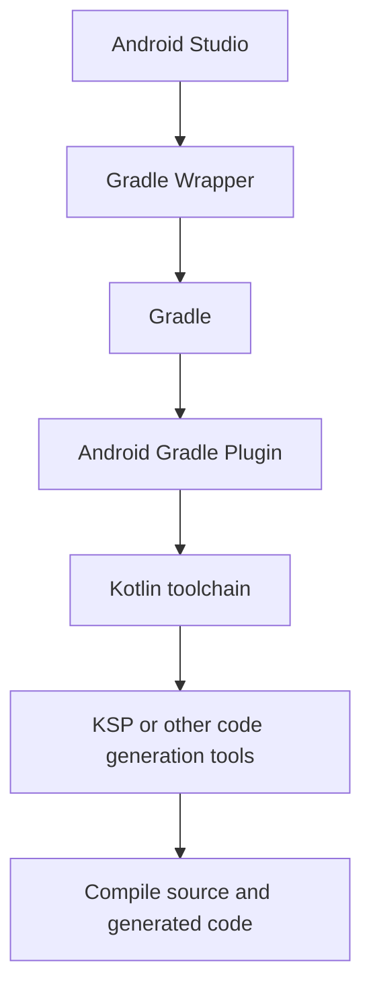
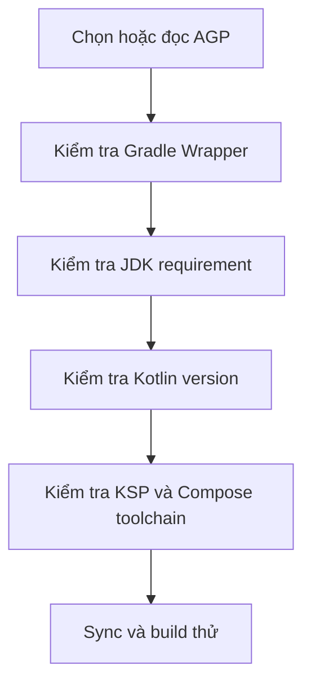

# Hiểu Gradle, AGP, Kotlin, KSP và cách đọc compatibility matrix

## Vì sao người mới hay bị rối ở chỗ này?
Khi mới học Android, bạn thường nghe rất nhiều tên cùng xuất hiện trong một lỗi build:

- Gradle
- Android Gradle Plugin (AGP)
- Kotlin
- KSP
- JDK
- Compose Compiler

Người mới thường có cảm giác rằng tất cả những thứ này đều “na ná nhau” và đều liên quan đến build. Điều đó đúng một phần, nhưng nếu không phân biệt rõ vai trò của từng thành phần, bạn sẽ rất khó hiểu vì sao chỉ đổi một version nhỏ mà project lại không sync được hoặc build hỏng.

Vì vậy, bài viết này có hai mục tiêu:

1. Giúp bạn hiểu rõ Gradle, AGP, Kotlin và KSP là gì và liên quan với nhau như thế nào.
2. Giúp bạn biết cách đọc compatibility matrix để chọn đúng version và tránh lỗi môi trường.

## Trước hết, từng thành phần này là gì?

## Gradle là gì?
Gradle là hệ thống build. Nó chịu trách nhiệm đọc các file cấu hình, tải dependency, chạy plugin, compile code, đóng gói ứng dụng, và chạy test.

Bạn có thể hiểu Gradle như một “bộ điều phối build”. Nó không phải là Android-specific. Bản thân Gradle là một build tool tổng quát có thể dùng cho nhiều loại project khác nhau.

Trong project Android, Gradle là động cơ build chính, còn Android-specific behavior sẽ do AGP bổ sung.

## Gradle Wrapper là gì?
Gradle Wrapper là bộ file như:

- `gradlew`
- `gradlew.bat`
- `gradle/wrapper/gradle-wrapper.properties`

Wrapper giúp project dùng đúng phiên bản Gradle mà project yêu cầu, thay vì phụ thuộc vào bản Gradle đang cài sẵn trong máy.

Đây là một điểm rất quan trọng. Người mới nên tập thói quen:

- Luôn build bằng Wrapper
- Không phụ thuộc vào Gradle cài hệ thống

## AGP là gì?
AGP là viết tắt của Android Gradle Plugin. Đây là plugin giúp Gradle hiểu cách build một ứng dụng Android.

AGP là nơi thêm vào các khả năng như:

- Hiểu `AndroidManifest.xml`
- Hiểu thư mục `res/`
- Quản lý `compileSdk`, `minSdk`, `targetSdk`
- Tạo build variants như `debug`, `release`
- Đóng gói APK hoặc AAB
- Kết nối với Android SDK build tools

Nếu không có AGP, Gradle vẫn chạy được, nhưng nó không biết cách build ứng dụng Android.

## Kotlin trong Android build là gì?
Kotlin ở đây cần được hiểu theo hai lớp:

1. Kotlin là ngôn ngữ bạn dùng để viết code.
2. Kotlin compiler và Kotlin Gradle plugin là phần giúp Gradle compile được code Kotlin.

Người mới hay nghĩ “em viết Kotlin thì chỉ cần biết cú pháp Kotlin”. Trên thực tế, ở tầng build bạn còn phải quan tâm đến Kotlin plugin version và mức độ tương thích của nó với AGP, Compose Compiler, KSP và đôi khi cả JDK.

Nói ngắn gọn:

- Kotlin trong source code là ngôn ngữ lập trình
- Kotlin trong build system là một thành phần của toolchain

## KSP là gì?
KSP là viết tắt của Kotlin Symbol Processing. Đây là cơ chế xử lý symbol của Kotlin để phục vụ code generation.

Nhiều thư viện Android dùng code generation, ví dụ:

- Room
- Hilt ở một số cấu hình
- Một số thư viện serialization hoặc dependency injection khác

Trước đây nhiều project dùng KAPT. Hiện nay nhiều thư viện dần hỗ trợ KSP để nhanh hơn và phù hợp hơn với Kotlin hiện đại.

Điểm người mới cần nhớ là:

- KSP không chỉ là một thư viện bình thường
- KSP có version và plugin riêng
- KSP thường phải tương thích rất chặt với Kotlin version

## Một thành phần liên quan rất hay đi kèm: Compose Compiler
Ngay cả khi bạn không định học Compose ngay, bạn vẫn nên biết công cụ này tồn tại.

Nếu project dùng Jetpack Compose, Compose Compiler là một phần rất quan trọng của toolchain Kotlin. Ở các stack Android mới, Compose Compiler có thể có cách quản lý version và plugin khác với trước đây.

Vì vậy, khi bạn đọc compatibility matrix cho project Android hiện đại, đừng chỉ nhìn AGP và Kotlin. Nếu project dùng Compose, bạn phải nhìn cả Compose Compiler nữa.

## Mối quan hệ giữa Gradle, AGP, Kotlin và KSP

Bạn có thể hình dung chuỗi phụ thuộc logic như sau:

Nhìn theo cách này sẽ dễ hiểu hơn:

- Android Studio là nơi bạn thao tác
- Wrapper quyết định bản Gradle nào sẽ chạy
- Gradle là build engine
- AGP thêm logic Android vào Gradle
- Kotlin toolchain giúp compile Kotlin
- KSP tham gia tạo source phát sinh nếu project cần

Chỉ cần một mắt xích lệch version hoặc lệch expectation, project có thể sync fail hoặc build fail.

## Vì sao compatibility lại quan trọng đến vậy?
Các công cụ trên không hoạt động độc lập hoàn toàn. Chúng phải hiểu nhau.

Ví dụ:

- Một bản AGP mới có thể yêu cầu Gradle mới hơn
- Một bản AGP nào đó có thể yêu cầu JDK tối thiểu cao hơn
- Một bản Kotlin mới có thể đòi KSP tương ứng khác
- Một bản Compose Compiler có thể yêu cầu setup khác với Kotlin cũ

Người mới rất hay phạm sai lầm này:

- Thấy có version mới thì nâng ngay
- Nâng nhiều thứ cùng lúc
- Không đọc compatibility matrix
- Không kiểm tra release notes

Kết quả là project hỏng nhưng không rõ hỏng vì thành phần nào.

## Compatibility matrix là gì?
Compatibility matrix là bảng hoặc tài liệu mô tả những phiên bản nào được hỗ trợ khi đi cùng nhau.

Nó thường trả lời các câu hỏi như:

- AGP này chạy với Gradle nào?
- AGP này yêu cầu JDK tối thiểu là gì?
- Kotlin version này có tương thích với plugin hoặc compiler nào?
- KSP version nào đi cùng Kotlin version nào?
- Compose Compiler hoặc plugin setup có thay đổi gì theo Kotlin version không?

Nói đơn giản, compatibility matrix giúp bạn tránh phải đoán.

## Compatibility matrix thường nằm ở đâu?
Bạn có thể gặp compatibility information ở nhiều nơi:

- Release notes của Android Gradle Plugin: https://developer.android.com/build/releases/about-agp
- Tài liệu tương thích của Gradle với Java: https://docs.gradle.org/current/userguide/compatibility.html
- Release notes của Kotlin: https://kotlinlang.org/docs/releases.html
- Release notes hoặc trang phát hành của KSP: https://github.com/google/ksp/releases
- Tài liệu cài đặt Compose hoặc plugin tương ứng: https://developer.android.com/jetpack/compose/setup
Điều quan trọng là đừng chờ tới lúc build lỗi mới đọc. Nếu bạn đang nâng version, hãy đọc trước.

## Cách đọc compatibility matrix từng bước

Đây là phần quan trọng nhất của bài viết.

## Bước 1: Chọn một điểm bắt đầu, không nhìn tất cả cùng lúc
Khi nhìn vào một bảng compatibility, người mới hay bị choáng vì có quá nhiều cột và quá nhiều version.

Cách đọc đúng là chọn một điểm bắt đầu.

Thông thường, bạn sẽ có một trong ba tình huống sau:

1. Bạn đang tạo project mới
2. Bạn đang mở project cũ của người khác
3. Bạn đang nâng version cho project đang chạy ổn

Mỗi tình huống sẽ có điểm bắt đầu khác nhau.

- Project mới: thường bắt đầu từ Android Studio stable và AGP phù hợp
- Project cũ: bắt đầu từ version đang có trong repo
- Project đang nâng cấp: bắt đầu từ thành phần bạn muốn nâng trước

## Bước 2: Xác định thành phần neo
Trong thực tế Android, thành phần neo thường là một trong hai thứ:

- AGP
- Android Studio

Lý do là AGP quyết định rất nhiều về build model của project Android. Nếu AGP thay đổi mạnh, những phần còn lại như Gradle, Kotlin DSL, plugin behavior, và JDK requirements có thể bị ảnh hưởng.

Vì vậy, khi đọc matrix, bạn nên tự hỏi:

- AGP mình đang dùng là gì?
- Android Studio hiện tại có phù hợp với AGP này không?

## Bước 3: Từ AGP, đọc ra Gradle requirement
Sau khi biết AGP, hãy kiểm tra AGP đó yêu cầu hoặc hỗ trợ Gradle version nào.

Điều này rất quan trọng vì nhiều lỗi sync thực chất chỉ là do:

- Gradle quá cũ cho AGP hiện tại
- Hoặc ngược lại, project pin một bản Gradle chưa phù hợp với AGP

Nguồn sự thật trong project thường là:

- `gradle/wrapper/gradle-wrapper.properties`

Nếu matrix nói AGP cần một line Gradle khác, file wrapper này thường là nơi bạn phải kiểm tra đầu tiên.

## Bước 4: Đọc tiếp requirement về JDK
Sau khi xác nhận AGP và Gradle, hãy nhìn requirement về Java hoặc JDK.

Đây là chỗ người mới hay nhầm nhất, vì có hai thứ rất dễ bị lẫn:

- JDK dùng để chạy Gradle
- Java version dùng để compile source code

Chúng liên quan với nhau nhưng không hoàn toàn giống nhau.

Khi đọc matrix, hãy xem rõ:

- AGP hoặc Gradle yêu cầu JDK tối thiểu là bao nhiêu
- Android Studio đang dùng JDK nào cho Gradle
- Terminal đang dùng JDK nào nếu bạn build bằng lệnh

## Bước 5: Kiểm tra Kotlin version
Sau khi xác định AGP, Gradle và JDK, bạn mới nên kiểm tra Kotlin.

Người mới thường nâng Kotlin trước vì thấy “code mình viết bằng Kotlin”. Nhưng ở tầng build, Kotlin không nên là điểm bắt đầu đầu tiên nếu bạn chưa xác nhận AGP và Gradle.

Hãy kiểm tra:

- Project đang pin Kotlin version ở đâu
- Kotlin version đó có tương thích với AGP hiện tại không
- Có release note nào nói DSL hoặc plugin behavior thay đổi không

## Bước 6: Từ Kotlin, kiểm tra KSP
KSP thường đi rất sát với Kotlin.

Nhiều khi bạn sẽ thấy version KSP có dạng như:

- `2.0.21-1.0.xx`

Nhìn vào đó bạn có thể hiểu rằng line KSP này đang gắn với line Kotlin tương ứng.

Điều quan trọng là:

- Đừng chọn KSP ngẫu nhiên
- Đừng thấy số lớn hơn là nâng luôn
- Hãy kiểm tra release hoặc tài liệu phát hành của KSP để xác nhận version thật sự tồn tại và dành cho Kotlin line bạn đang dùng

## Bước 7: Nếu có Compose, kiểm tra Compose Compiler hoặc plugin setup
Nếu project dùng Compose, compatibility story chưa dừng ở Kotlin.

Bạn còn cần kiểm tra:

- Compose Compiler hoặc plugin setup hiện tại là gì
- Cách khai báo có thay đổi theo Kotlin version không
- Project có đang dùng kiểu cấu hình cũ không

Đây là lý do cùng một project có thể build được trên một stack cũ nhưng fail ngay khi bạn chỉ nâng Kotlin.

## Một cách đọc matrix dễ nhớ cho người mới
Bạn có thể dùng thứ tự sau mỗi khi cần kiểm tra compatibility:

1. Android Studio
2. AGP
3. Gradle Wrapper
4. JDK
5. Kotlin
6. KSP
7. Compose Compiler hoặc công cụ code generation liên quan

Điểm quan trọng là không nên đọc ngược thứ tự này một cách ngẫu nhiên.

## Trong project, đọc source of truth ở đâu?
Một project Android hiện đại thường lưu thông tin ở những chỗ sau:

| Thông tin | Nơi kiểm tra đầu tiên |
| --- | --- |
| Gradle Wrapper version | `gradle/wrapper/gradle-wrapper.properties` |
| AGP version | `gradle/libs.versions.toml` hoặc root `build.gradle.kts` |
| Kotlin version | `gradle/libs.versions.toml` hoặc plugin declarations |
| KSP version | `gradle/libs.versions.toml` hoặc plugin declarations |
| JDK dùng trong Android Studio | `File > Settings > Build, Execution, Deployment > Build Tools > Gradle` |
| SDK Platform đã cài chưa | `Tools > SDK Manager` |
| Module có apply plugin nào | `build.gradle.kts` của từng module |

Người mới nên học cách đọc project từ những nơi này trước khi sửa.

## Một ví dụ đọc compatibility theo tư duy đúng
Giả sử bạn mở một project và thấy lỗi liên quan tới plugin hoặc sync fail. Thay vì làm ngẫu nhiên, bạn có thể đi như sau:

1. Mở `gradle-wrapper.properties` để xem project đang dùng Gradle nào.
2. Mở `libs.versions.toml` hoặc root build file để xem AGP, Kotlin, KSP đang là bao nhiêu.
3. Mở Android Studio settings để xem Gradle JDK.
4. So các version đó với tài liệu tương thích chính thức.
5. Nếu project dùng Compose, kiểm tra thêm cách khai báo Compose Compiler hoặc plugin Compose.

Điều quan trọng ở đây không phải là thuộc lòng mọi version, mà là biết mình phải đối chiếu những cặp nào.

## Quy trình nâng version an toàn
Nếu bạn muốn nâng cấp stack build, đừng nâng mọi thứ cùng lúc.

Một quy trình an toàn hơn là:

1. Xác định mục tiêu nâng gì trước, ví dụ AGP hoặc Kotlin.
2. Đọc compatibility matrix và release notes tương ứng.
3. Chuẩn bị cặp version đi cùng, ví dụ AGP với Gradle, hoặc Kotlin với KSP.
4. Sửa một nhóm nhỏ các version liên quan.
5. Sync project.
6. Chạy `assembleDebug`.
7. Chạy test quan trọng nếu project có.
8. Chỉ khi ổn mới nâng tiếp nhóm khác.

Người mới rất nên tránh kiểu nâng như sau:

- Đổi AGP
- Đổi Gradle
- Đổi Kotlin
- Đổi KSP
- Đổi thêm Compose

trong cùng một lần mà chưa build thử ở giữa.

## Dấu hiệu thường gặp khi compatibility bị lệch

### Lệch giữa AGP và Gradle
Bạn có thể gặp:

- Sync fail rất sớm
- Plugin Android không load được
- Thông báo yêu cầu Gradle version khác

### Lệch giữa Gradle hoặc AGP với JDK
Bạn có thể gặp:

- Gradle daemon không khởi động
- Lỗi liên quan Java runtime
- Android Studio sync được nhưng terminal build không được, hoặc ngược lại

### Lệch giữa Kotlin và plugin liên quan
Bạn có thể gặp:

- Plugin conflict
- DSL block cũ không còn hợp lệ
- Compose plugin hoặc compiler báo thiếu
- Build script báo unresolved reference ở phần Kotlin DSL

### Lệch giữa Kotlin và KSP
Bạn có thể gặp:

- Plugin KSP không resolve được
- Source generated không xuất hiện đúng
- Build fail ở bước code generation

## Những sai lầm người mới nên tránh

- Chỉ nhìn mỗi version trong file mà không đọc release notes
- Thấy version mới là nâng ngay
- Nâng cùng lúc quá nhiều thành phần của build stack
- Không phân biệt JDK runtime với Java compile target
- Không kiểm tra xem project có dùng Compose hoặc KSP hay không trước khi nâng Kotlin
- Chỉ nhìn Android Studio UI mà không đọc file cấu hình thực tế

## Android Studio giúp gì trong câu chuyện compatibility?
Android Studio không thay bạn đọc compatibility matrix, nhưng nó giúp bạn kiểm tra trạng thái hiện tại rất nhanh.

Bạn nên biết các chỗ sau:

- `Tools > SDK Manager`: kiểm tra SDK platforms và build tools
- `File > Settings > Build, Execution, Deployment > Build Tools > Gradle`: kiểm tra Gradle JDK
- `File > Project Structure`: xem module, dependency, SDK location, project settings
- `Build Output` và `Problems`: đọc lỗi sync/build
- `Terminal`: chạy `gradlew.bat -version`, `gradlew.bat tasks`, `gradlew.bat assembleDebug`

## Cách học phần này mà không bị ngợp
Người mới không cần cố nhớ mọi combination version. Cách học hiệu quả hơn là:

1. Hiểu vai trò của từng công cụ.
2. Hiểu mối quan hệ giữa chúng.
3. Biết file nào đang giữ version nào.
4. Biết thứ tự cần đối chiếu khi nâng cấp hoặc debug.

Khi đã quen với bốn điểm này, compatibility matrix sẽ không còn là một bảng đáng sợ nữa. Nó chỉ là một bản đồ để bạn chọn đúng đường.

## Tổng kết

Bạn có thể nhớ rất ngắn gọn như sau:

- Gradle là build engine
- AGP là plugin giúp Gradle build Android
- Kotlin là ngôn ngữ và cũng là một phần của toolchain compile
- KSP là công cụ code generation gắn chặt với Kotlin
- Compatibility matrix là tài liệu giúp bạn biết những version nào đi được với nhau

Khi đọc matrix, hãy đi theo thứ tự có logic: AGP và Android Studio trước, rồi Gradle và JDK, sau đó mới đến Kotlin, KSP và các plugin liên quan. Làm như vậy, bạn sẽ giảm được rất nhiều lỗi môi trường và tránh nâng version theo cảm tính.

## Đọc thêm

- Android Gradle Plugin release notes
- Gradle Java compatibility documentation
- Kotlin Gradle plugin documentation
- KSP documentation hoặc release notes
- Jetpack Compose setup documentation nếu project dùng Compose

