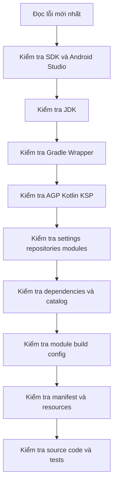

# Quy trình debug lỗi Sync và Build Android theo từng tầng

## Vì sao lỗi sync và build trong Android thường làm người mới bối rối?
Lỗi sync và build của Android rất dễ tạo cảm giác “không biết bắt đầu từ đâu”.

Bạn có thể chỉ nhìn thấy một thông báo ngắn như:

- Gradle sync failed
- Plugin not found
- SDK location not found
- Resource linking failed
- Unresolved reference

Nhưng phía sau một thông báo như vậy có thể là rất nhiều nguyên nhân khác nhau. Nếu sửa theo cảm tính, bạn rất dễ rơi vào vòng lặp:

1. Sửa một chỗ ngẫu nhiên
2. Lỗi khác xuất hiện
3. Tiếp tục sửa chỗ khác
4. Cuối cùng không biết project đang hỏng vì nguyên nhân nào

Vì vậy, cách tốt hơn là debug theo từng tầng. Mỗi tầng đại diện cho một lớp của hệ thống build Android.

## Trước hết, cần phân biệt Sync và Build

- **Sync**: Android Studio đọc cấu hình Gradle, tải plugin và dependency, phân tích project, và chuẩn bị để IDE hiểu project.
- **Build**: Gradle thực sự compile code, xử lý resource, generate source, merge manifest, rồi tạo output như APK hoặc AAB.

Người mới cần nhớ:

- Một project có thể fail ở bước sync trước khi kịp build
- Một project có thể sync được nhưng build vẫn fail

Vì vậy, debug sync và debug build có liên quan nhưng không hoàn toàn giống nhau.

## Tư duy debug đúng trước khi bắt đầu

Trước khi nói về từng tầng, bạn nên nhớ bốn nguyên tắc này.

### 1. Không đoán mò
Luôn bắt đầu từ lỗi thật sự mới nhất mà tool đang báo.

### 2. Sửa từ tầng thấp lên tầng cao
Nếu JDK hoặc SDK sai, việc sửa dependency trước thường không có ý nghĩa.

### 3. Một thay đổi nhỏ, một lần kiểm tra
Đừng sửa năm file một lúc rồi hy vọng mọi thứ sẽ ổn.

### 4. Android Studio rất hữu ích, nhưng terminal giúp xác nhận rõ hơn
Android Studio cho bạn nhiều gợi ý, nhưng khi cần chắc chắn, lệnh Gradle ở terminal thường cho log rõ hơn.

## Mô hình debug theo từng tầng

Bạn có thể hình dung quy trình debug theo các tầng sau:

1. SDK và Android Studio
2. JDK
3. Gradle Wrapper và Gradle daemon
4. AGP, Kotlin, KSP và plugin resolution
5. `settings.gradle.kts`, repositories và module structure
6. Dependencies và version catalog
7. `build.gradle.kts` của module
8. `AndroidManifest.xml` và resources
9. Source code, generated code và tests

Khi debug, nên đi theo thứ tự này thay vì nhảy lung tung.

## Tầng 1: SDK và Android Studio

Đây là tầng đầu tiên cần kiểm tra nếu project vừa clone về hoặc vừa mở trên máy mới.

### Những dấu hiệu thường gặp

- `SDK location not found`
- `Failed to find target with hash string`
- Không có platform tương ứng với `compileSdk`
- Emulator hoặc device config không hoạt động như mong đợi

### Bạn nên kiểm tra ở đâu?

- `Tools > SDK Manager`
- `File > Project Structure > SDK Location`
- `local.properties`

### Bạn nên kiểm tra điều gì?

1. Máy đã cài Android SDK chưa
2. Đã cài đúng SDK Platform mà project yêu cầu chưa
3. `local.properties` có trỏ đúng `sdk.dir` không
4. Android Studio có đang nhận đúng SDK location không

### Cách xử lý phổ biến

- Cài thiếu SDK Platform trong SDK Manager
- Sửa lại `sdk.dir` trong `local.properties`
- Nếu mở project trên máy mới, để Android Studio nhận lại SDK location đúng

### Điều người mới hay làm sai

- Thấy lỗi sync rồi sửa ngay Gradle trong khi thực ra chỉ thiếu SDK Platform

## Tầng 2: JDK

Sau SDK, tầng rất hay gây lỗi là JDK.

### Những dấu hiệu thường gặp

- `JAVA_HOME is not set`
- Gradle daemon không khởi động
- Lỗi nói rằng Java version không phù hợp
- Android Studio sync được nhưng terminal build fail, hoặc ngược lại

### Kiểm tra ở đâu?

- Android Studio: `File > Settings > Build, Execution, Deployment > Build Tools > Gradle`
- Terminal: chạy `gradlew.bat -version`

### Bạn nên hiểu điều gì?

- Android Studio có thể dùng một Gradle JDK riêng
- Terminal có thể dùng JDK khác thông qua `JAVA_HOME` hoặc PATH
- Vì vậy, lỗi trong IDE và lỗi trong terminal có thể khác nhau dù cùng một project

### Cách xử lý phổ biến

- Chọn đúng Gradle JDK trong Android Studio
- Nếu build bằng terminal, cấu hình `JAVA_HOME` đúng
- Đảm bảo JDK đang dùng phù hợp với stack Gradle và AGP của project

### Điều người mới hay làm sai

- Chỉ nhìn vào `sourceCompatibility` hoặc `jvmTarget` rồi nghĩ đó là JDK runtime đang dùng

## Tầng 3: Gradle Wrapper và Gradle daemon

Khi SDK và JDK đã ổn, bạn nên kiểm tra chính công cụ build.

### Những dấu hiệu thường gặp

- Wrapper không chạy được
- Sync fail rất sớm, trước cả khi resolve plugin Android
- Gradle daemon bị treo hoặc lỗi lặp lại kỳ lạ

### Kiểm tra ở đâu?

- `gradle/wrapper/gradle-wrapper.properties`
- Terminal với các lệnh:

```powershell
gradlew.bat -version
gradlew.bat tasks
gradlew.bat --stop
```

### Bạn nên kiểm tra điều gì?

1. Project có dùng Wrapper không
2. Wrapper đang pin bản Gradle nào
3. Bản Gradle đó có phù hợp với AGP không
4. Gradle daemon có khởi động được không

### Cách xử lý phổ biến

- Không dùng Gradle cài sẵn trong máy, chỉ dùng Wrapper
- Nếu daemon bị trạng thái xấu, có thể thử `gradlew.bat --stop` rồi chạy lại
- Kiểm tra file wrapper nếu project vừa được nâng version

### Điều người mới hay làm sai

- Chạy `gradle` thay vì `gradlew` hoặc `gradlew.bat`

## Tầng 4: AGP, Kotlin, KSP và plugin resolution

Đây là tầng rất hay vỡ khi nâng version hoặc clone project dùng stack mới.

### Những dấu hiệu thường gặp

- Plugin không resolve được
- Plugin conflict
- `kotlinOptions` hoặc DSL nào đó không còn hợp lệ
- KSP version không tồn tại hoặc không khớp
- Compose plugin hoặc compiler báo thiếu

### Kiểm tra ở đâu?

- Root `build.gradle.kts`
- `gradle/libs.versions.toml`
- Module `build.gradle.kts`
- `settings.gradle.kts` phần `pluginManagement`

### Bạn nên kiểm tra điều gì?

1. AGP version là bao nhiêu
2. Gradle Wrapper có phù hợp với AGP không
3. Kotlin version là bao nhiêu
4. KSP có khớp line Kotlin không
5. Project có đang dùng Compose hay plugin code generation nào đặc biệt không

### Cách xử lý phổ biến

- Đọc compatibility matrix thay vì đoán
- Kiểm tra plugin alias trong version catalog
- Kiểm tra plugin có được apply đúng ở module hay root không
- Nếu KSP không resolve, xác nhận version đó có thật và phù hợp với Kotlin line hiện tại

### Điều người mới hay làm sai

- Nâng Kotlin nhưng quên nhìn KSP
- Nâng AGP nhưng quên nhìn Gradle Wrapper
- Cố sửa code trong khi lỗi thật sự nằm ở plugin setup

## Tầng 5: `settings.gradle.kts`, repositories và module structure

Khi plugin stack ổn mà project vẫn sync fail hoặc module không nhận, hãy nhìn vào cấu trúc project.

### Những dấu hiệu thường gặp

- Module không xuất hiện trong project
- `project(:some-module)` không resolve được
- Dependency hoặc plugin không tải được vì repository config sai

### Kiểm tra ở đâu?

- `settings.gradle.kts`
- `File > Project Structure`
- Cửa sổ Project trong Android Studio

### Bạn nên kiểm tra điều gì?

1. Module đã được `include(...)` chưa
2. Tên module có đúng không
3. `pluginManagement` và `dependencyResolutionManagement` có repository đúng không
4. Project có đang để mỗi module tự thêm repository riêng không

### Cách xử lý phổ biến

- Thêm đúng `include(...)`
- Chuẩn hóa repositories ở cấp project
- Sync lại sau khi sửa cấu trúc module

### Điều người mới hay làm sai

- Tạo thư mục module xong nghĩ rằng project sẽ tự nhận
- Thêm repository rải rác ở nhiều nơi rồi khó kiểm soát dependency resolution

## Tầng 6: Dependencies và version catalog

Khi sync qua được tầng plugin nhưng build hoặc resolve dependency vẫn lỗi, hãy nhìn vào dependency graph.

### Những dấu hiệu thường gặp

- Không tìm thấy thư viện
- Version rỗng hoặc alias không resolve được
- Thêm dependency rồi nhưng code vẫn không nhận
- Test dependency hoặc debug dependency bị thiếu riêng

### Kiểm tra ở đâu?

- `gradle/libs.versions.toml`
- `build.gradle.kts` của module
- Terminal với lệnh:

```powershell
gradlew.bat dependencies
gradlew.bat :app:dependencies --configuration debugRuntimeClasspath
```

### Bạn nên kiểm tra điều gì?

1. Alias trong `libs.versions.toml` có đúng không
2. Version có tồn tại không
3. Dependency được thêm vào đúng scope chưa
4. Nếu dùng BOM, BOM đã được thêm đúng scope chưa

### Cách xử lý phổ biến

- Sửa alias hoặc version trong version catalog
- Đặt dependency vào đúng scope như `implementation`, `testImplementation`, `androidTestImplementation`
- Nếu dùng BOM, nhớ thêm BOM ở scope tương ứng

### Điều người mới hay làm sai

- Chỉ thêm library mà quên thêm BOM đi kèm
- Dùng sai scope nên build chính được nhưng test fail, hoặc ngược lại

## Tầng 7: `build.gradle.kts` của module

Khi dependency và plugin đã ổn, hãy nhìn vào cấu hình module cụ thể.

### Những dấu hiệu thường gặp

- `compileSdk` không hợp lệ
- `namespace` hoặc `applicationId` gây lỗi
- Build type hoặc flavor không hoạt động như mong đợi
- Packaging, signing, build features cấu hình sai

### Kiểm tra ở đâu?

- `app/build.gradle.kts` hoặc module tương ứng
- `Build Variants` trong Android Studio

### Bạn nên kiểm tra điều gì?

1. `compileSdk`, `minSdk`, `targetSdk`
2. `buildTypes` và `productFlavors`
3. `buildFeatures`
4. Plugin nào đang được apply ở module
5. Dependency nội bộ giữa các module có đúng không

### Cách xử lý phổ biến

- Nếu đổi `compileSdk`, cài thêm SDK platform tương ứng
- Kiểm tra variant đang build có đúng không
- Kiểm tra cấu hình feature như Compose hoặc viewBinding đã bật chưa

### Điều người mới hay làm sai

- Sửa nhầm root `build.gradle.kts` trong khi lỗi nằm ở module build file
- Không để ý mình đang build variant nào

## Tầng 8: `AndroidManifest.xml` và resources

Đây là tầng thường gây lỗi sau khi plugin và dependency đã qua.

### Những dấu hiệu thường gặp

- Resource linking failed
- Theme, style, attr không tìm thấy
- Permission không có tác dụng như mong đợi
- Activity hoặc deep link không hoạt động đúng

### Kiểm tra ở đâu?

- `AndroidManifest.xml`
- Tab `Merged Manifest`
- Thư mục `res/`
- Build Output hoặc error panel của Android Studio

### Bạn nên kiểm tra điều gì?

1. Manifest cuối cùng sau khi merge trông như thế nào
2. Resource, style, theme có đang tham chiếu đúng thư viện không
3. Có thiếu dependency UI hoặc Material nào không
4. Component có cần `android:exported` nhưng chưa khai báo không

### Cách xử lý phổ biến

- Xem `Merged Manifest` thay vì chỉ nhìn file gốc
- Kiểm tra dependency UI nếu theme hoặc attr không tìm thấy
- Kiểm tra tên resource và package reference

### Điều người mới hay làm sai

- Nghĩ rằng lỗi resource là lỗi code Kotlin
- Chỉ sửa manifest gốc mà không xem kết quả merge cuối cùng

## Tầng 9: Source code, generated code và tests

Đây là tầng cao nhất. Chỉ nên tập trung mạnh vào tầng này sau khi các tầng dưới đã ổn.

### Những dấu hiệu thường gặp

- `Unresolved reference`
- Thiếu import
- Source generated không xuất hiện
- Test fail do dependency test hoặc variant test

### Kiểm tra ở đâu?

- Source code Kotlin hoặc Java
- Generated sources nếu project dùng KSP hoặc công cụ code generation khác
- Test source sets như `test` và `androidTest`

### Cách xử lý phổ biến

- Kiểm tra import và symbol thật sự có tồn tại không
- Nếu liên quan code generation, quay ngược lại kiểm tra KSP hoặc plugin config
- Nếu chỉ test fail, kiểm tra dependency test riêng trước

### Điều người mới hay làm sai

- Thấy `Unresolved reference` là sửa code ngay, trong khi nguyên nhân có thể là dependency chưa resolve hoặc source generated chưa được tạo ra

## Bộ lệnh terminal rất hữu ích khi debug

Người mới nên nhớ một số lệnh cơ bản sau:

```powershell
gradlew.bat -version
gradlew.bat tasks
gradlew.bat assembleDebug
gradlew.bat test
gradlew.bat lint
gradlew.bat --stop
gradlew.bat :app:dependencies --configuration debugRuntimeClasspath
gradlew.bat assembleDebug --stacktrace
```

Những lệnh này giúp bạn trả lời các câu hỏi rất quan trọng:

- Gradle runtime có chạy được không
- Project có load task được không
- Build chính có chạy được không
- Dependency graph có vấn đề gì không
- Lỗi chi tiết nằm ở đâu nếu cần stacktrace

## Khi nào nên dùng các công cụ của Android Studio?

Android Studio rất hữu ích nếu bạn dùng đúng chỗ:

- `SDK Manager`: khi nghi ngờ thiếu SDK platform hoặc build tools
- `Gradle settings`: khi nghi ngờ JDK hoặc Gradle runtime
- `Project Structure`: khi nghi ngờ module, dependency, SDK location
- `Build Variants`: khi nghi ngờ build nhầm variant
- `Merged Manifest`: khi nghi ngờ manifest không có tác dụng hoặc bị conflict
- `Build Output`: khi cần log chi tiết của quá trình build
- `Problems`: khi muốn nhìn nhanh danh sách lỗi IDE đã tổng hợp

## Những sai lầm phổ biến khi debug sync/build

- Xóa cache hoặc Invalidate Caches ngay từ đầu mà chưa đọc lỗi kỹ
- Sửa nhiều tầng cùng lúc
- Không phân biệt lỗi môi trường với lỗi code
- Chỉ build trong Android Studio mà không thử terminal
- Chỉ thử terminal mà không xem các màn hình kiểm tra hữu ích của Android Studio
- Nhảy ngay xuống source code trong khi tầng SDK, JDK hoặc plugin còn chưa ổn

## Checklist debug 5 phút cho người mới

Khi project lỗi sync hoặc build, bạn có thể đi theo checklist ngắn này:

1. Đọc lỗi mới nhất thật kỹ.
2. Kiểm tra SDK trong Android Studio.
3. Kiểm tra Gradle JDK và thử `gradlew.bat -version`.
4. Kiểm tra Wrapper version.
5. Kiểm tra AGP, Kotlin, KSP trong file cấu hình.
6. Kiểm tra `settings.gradle.kts` nếu có vấn đề module hoặc repository.
7. Kiểm tra dependencies và version catalog.
8. Kiểm tra `app/build.gradle.kts`.
9. Kiểm tra `Merged Manifest` và resources nếu lỗi liên quan Android config.
10. Cuối cùng mới tập trung hoàn toàn vào source code.

## Tổng kết

Lỗi sync và build Android khó không phải vì từng lỗi riêng lẻ quá phức tạp, mà vì nhiều tầng của hệ thống phụ thuộc vào nhau. Nếu bạn sửa theo cảm tính, lỗi sẽ rất dễ dây chuyền.

Cách chắc chắn hơn là đi từ thấp lên cao:

- SDK và Android Studio
- JDK
- Gradle Wrapper
- AGP, Kotlin, KSP
- settings và repositories
- dependencies
- build config của module
- manifest và resources
- cuối cùng mới tới source code

Khi bạn giữ được trật tự này, việc debug sẽ bớt hỗn loạn rất nhiều. Mỗi lỗi sẽ trở thành một bước kiểm tra có hệ thống, thay vì một cuộc đoán mò.

