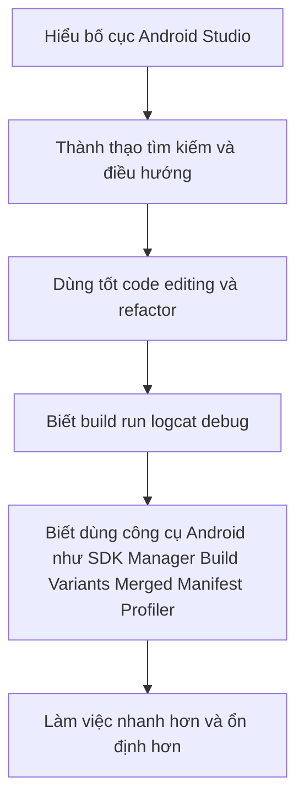

# Sử dụng Android Studio hiệu quả cho phát triển ứng dụng Android

## Vì sao cần học dùng Android Studio một cách nghiêm túc?
Nhiều người mới học Android thường xem Android Studio chỉ là nơi để gõ code, bấm Run, và xem lỗi. Cách nhìn này chưa đủ.

Android Studio không chỉ là một trình soạn thảo mã nguồn. Nó là một môi trường phát triển tích hợp dành riêng cho Android, được thiết kế để giúp bạn:

- Tạo và tổ chức project
- Sync và build bằng Gradle
- Quản lý SDK, JDK, emulator và device
- Debug ứng dụng
- Kiểm tra Logcat
- Phân tích hiệu năng
- Quan sát manifest, resources, build variants và dependencies
- Refactor code an toàn

Nếu bạn dùng Android Studio chỉ ở mức tối thiểu, bạn vẫn có thể làm được việc. Nhưng nếu bạn dùng nó thành thạo, tốc độ làm việc và chất lượng xử lý vấn đề của bạn sẽ khác hẳn.

Vì vậy, bài viết này hướng dẫn bạn sử dụng Android Studio hiệu quả, có hệ thống, và đủ thực dụng để tiến gần hơn tới cách làm việc của một người đã quen nghề.

## Bảng tra nhanh tổ hợp phím

Bảng này dùng để tra cứu nhanh. Nếu bạn đã đọc bài 1 đến 2 lần, phần này sẽ là nơi quay lại thường xuyên nhất.

**Lưu ý:** các tổ hợp phím dưới đây ưu tiên theo Windows/Linux.

| Tác vụ | Phím tắt | Dùng khi nào |
| --- | --- | --- |
| Search Everywhere | `Shift` hai lần | Khi muốn tìm file, class, action, setting hoặc menu command |
| Go to File | `Ctrl + Shift + N` | Khi muốn mở nhanh một file theo tên |
| Go to Class | `Ctrl + N` | Khi muốn nhảy nhanh tới một class hoặc interface |
| Go to Symbol | `Ctrl + Alt + Shift + N` | Khi muốn tìm function, property hoặc symbol cụ thể |
| Recent Files | `Ctrl + E` | Khi muốn mở lại file vừa dùng gần đây |
| Recent Locations | `Ctrl + Shift + E` | Khi muốn quay lại vị trí vừa sửa hoặc vừa đọc |
| Go to Declaration | `Ctrl + B` | Khi muốn nhảy tới nơi định nghĩa của symbol |
| Find Usages | `Alt + F7` | Khi muốn biết một class, function, field hoặc resource đang được dùng ở đâu |
| File Structure | `Ctrl + F12` | Khi muốn nhảy nhanh trong một file dài |
| Quick Fix | `Alt + Enter` | Khi muốn xem gợi ý sửa lỗi, import hoặc action thông minh |
| Rename | `Shift + F6` | Khi muốn đổi tên symbol một cách an toàn |
| Extract Method | `Ctrl + Alt + M` | Khi muốn tách một đoạn code thành hàm riêng |
| Extract Variable | `Ctrl + Alt + V` | Khi muốn đặt tên cho một biểu thức |
| Reformat Code | `Ctrl + Alt + L` | Khi muốn chuẩn hóa format code |
| Optimize Imports | `Ctrl + Alt + O` | Khi muốn xóa import thừa |
| Run current configuration | `Shift + F10` | Khi muốn chạy app hoặc cấu hình hiện tại |
| Debug current configuration | `Shift + F9` | Khi muốn chạy app ở chế độ debug |
| Toggle Breakpoint | `Ctrl + F8` | Khi muốn đặt hoặc bỏ breakpoint |
| Step Into | `F7` | Khi muốn đi vào lời gọi hàm lúc debug |
| Step Over | `F8` | Khi muốn chạy qua dòng hiện tại lúc debug |
| Step Out | `Shift + F8` | Khi muốn thoát khỏi hàm hiện tại lúc debug |
| Resume Program | `F9` | Khi muốn tiếp tục chạy debugger tới breakpoint tiếp theo |
| Evaluate Expression | `Alt + F8` | Khi muốn kiểm tra nhanh giá trị biểu thức trong lúc debug |
| Open Terminal | `Alt + F12` | Khi muốn mở terminal ngay trong Android Studio |
| Project tool window | `Alt + 1` | Khi muốn mở nhanh cây thư mục project |

Nếu bạn quên một phím tắt, cách an toàn nhất là nhấn `Shift` hai lần rồi gõ tên action tương ứng.

## Tư duy đúng khi học Android Studio

Trước khi học menu hay phím tắt, bạn nên có một tư duy đúng.

Android Studio không phải là thứ bạn phải “nhớ hết”. Thay vào đó, bạn cần nắm ba điều:

1. Biết công cụ nào dùng để làm gì.
2. Biết khi nào nên mở đúng công cụ đó.
3. Biết những thao tác nào dùng thường xuyên nhất để biến chúng thành phản xạ.

Nói cách khác, mục tiêu không phải là biết mọi nút trong IDE, mà là biết những phần nào tác động trực tiếp tới hiệu suất làm việc Android hằng ngày.

## Quy ước trong bài

Để bài viết này dễ dùng như một handbook thực hành, mình dùng quy ước sau:

- Các phím tắt được ưu tiên ghi theo **Windows/Linux** vì đây là môi trường phổ biến với người mới bắt đầu.
- Nếu bạn dùng macOS, hãy dùng tên action tương ứng trong Android Studio hoặc nhấn `Shift` hai lần rồi gõ tên action để tìm đúng lệnh.
- Mỗi mục quan trọng sẽ cố gắng trả lời ba câu hỏi: mở ở đâu, bấm gì, và dùng như thế nào cho đúng.

Điều này rất quan trọng vì biết khái niệm mà không biết thao tác thì gần như chưa dùng được công cụ.

## Bắt đầu từ bố cục tổng thể của Android Studio

Khi mở Android Studio, bạn thường sẽ làm việc với một số khu vực chính.

## Editor
Đây là vùng trung tâm để đọc và viết code, chỉnh file cấu hình, xem XML, xem manifest, xem Markdown, và làm hầu hết công việc hằng ngày.

## Project tool window
Đây là nơi bạn duyệt cấu trúc project.

Cách mở nhanh:

- `View > Tool Windows > Project`
- Hoặc dùng `Alt + 1`

Người mới nên biết hai chế độ nhìn phổ biến:

- **Android**: Hiển thị project theo logic Android, dễ hiểu hơn khi mới bắt đầu.
- **Project**: Hiển thị đúng cấu trúc file thực tế trên ổ đĩa, rất quan trọng khi bạn làm việc với Gradle, docs, scripts, hoặc muốn hiểu project thật sự được tổ chức ra sao.

Lời khuyên rất thực dụng là:

- Dùng chế độ `Android` khi mới học hoặc khi tập trung vào app, res, manifest
- Dùng chế độ `Project` khi bạn cần nhìn đúng file thật, nhất là các file Gradle, docs, scripts, version catalog, hay module structure

Cách chuyển chế độ nhìn:

1. Mở `Project` tool window.
2. Nhìn lên dropdown ở phía trên panel project.
3. Chuyển giữa `Android`, `Project`, hoặc các chế độ khác tùy mục đích.

## Tool windows
Android Studio có nhiều cửa sổ công cụ. Không cần dùng hết, nhưng bạn nên thành thạo những cái sau:

- Project
- Terminal
- Logcat
- Build
- Problems
- Device Manager
- Build Variants
- Gradle
- Profiler
- App Inspection

Một người dùng Android Studio hiệu quả thường không chỉ nhìn editor, mà biết mở đúng tool window đúng lúc.

Cách mở tool window:

- Từ menu `View > Tool Windows`
- Hoặc từ thanh tool window ở cạnh IDE

Một vài cách mở nhanh rất đáng nhớ:

- Project: `Alt + 1`
- Terminal: `Alt + F12`
- Logcat: tìm bằng Search Everywhere hoặc mở trong `View > Tool Windows > Logcat`
- Gradle: `View > Tool Windows > Gradle`
- Build: `View > Tool Windows > Build`
- Problems: `View > Tool Windows > Problems`

## Những thiết lập đầu tiên nên kiểm tra khi mới cài Android Studio

Trước khi nói về tip trick, bạn nên biết những chỗ quan trọng cần kiểm tra ngay khi mới dùng Android Studio.

## SDK Manager
Mở ở:

- `Tools > SDK Manager`

Hoặc bạn có thể nhấn `Shift` hai lần rồi gõ `SDK Manager`.

Bạn cần biết nơi này để kiểm tra:

- Android SDK location
- SDK Platforms đã cài
- Platform-Tools
- Command-line Tools
- Emulator và system image

Nếu không biết dùng SDK Manager, bạn sẽ rất dễ bị chặn lại bởi các lỗi môi trường rất cơ bản.

Cách kiểm tra nhanh:

1. Mở `SDK Manager`.
2. Vào tab `SDK Platforms` để xem bạn đã cài Android platform tương ứng với `compileSdk` của project chưa.
3. Vào tab `SDK Tools` để kiểm tra `Android SDK Build-Tools`, `Platform-Tools`, `Command-line Tools`, `Android Emulator`.
4. Nếu thiếu thành phần nào, tick vào đó và nhấn `Apply`.

Khi nào nên mở chỗ này:

- Project báo thiếu SDK platform
- Build fail vì không tìm thấy Android target
- Bạn vừa chuyển sang máy mới
- Emulator không hoạt động đúng

## Gradle JDK
Mở ở:

- `File > Settings > Build, Execution, Deployment > Build Tools > Gradle`

Nếu muốn tìm nhanh, nhấn `Shift` hai lần rồi gõ `Gradle`.

Đây là nơi bạn kiểm tra JDK mà Android Studio dùng cho Gradle.

Người mới rất nên nhớ điểm này vì:

- Android Studio có thể dùng JDK khác với terminal
- Lỗi Java trong IDE và terminal có thể không giống nhau

Cách kiểm tra nhanh:

1. Mở màn hình `Gradle` trong Settings.
2. Tìm mục `Gradle JDK`.
3. Xem Android Studio đang dùng JDK nào.
4. Nếu project yêu cầu JDK khác, đổi đúng JDK rồi sync lại project.

Khi nào nên mở chỗ này:

- Sync fail vì Java
- `gradlew` chạy trong terminal khác với IDE
- Bạn vừa nâng AGP hoặc Gradle

## Project Structure
Mở ở:

- `File > Project Structure`

Phím tắt thường dùng trên Windows/Linux là `Ctrl + Alt + Shift + S`.

Đây là nơi giúp bạn xem tổng quát về:

- SDK location
- Danh sách module
- Dependencies
- Một số thiết lập build và project structure

Nơi này rất hữu ích để kiểm tra. Tuy nhiên, với project hiện đại dùng Kotlin DSL, version catalog và Git workflow rõ ràng, bạn vẫn nên ưu tiên sửa trực tiếp trong file cấu hình thay vì chỉ sửa bằng giao diện.

Cách dùng nhanh:

1. Mở `Project Structure`.
2. Vào `SDK Location` nếu bạn cần kiểm tra SDK path.
3. Vào `Modules` nếu bạn muốn xem module nào đang có trong project.
4. Vào `Dependencies` của module nếu bạn muốn kiểm tra dependency đã được IDE nhận chưa.

Đây là nơi tốt để quan sát. Còn khi cần thay đổi có thể review bằng Git, hãy sửa ở file cấu hình tương ứng.

## Chọn đúng cách mở và tìm file

Người dùng Android Studio hiệu quả không đi tìm file bằng chuột quá nhiều. Họ dùng tìm kiếm rất nhiều.

## Search Everywhere
Nhấn `Shift` hai lần.

Đây là một trong những tính năng mạnh nhất của Android Studio. Bạn có thể dùng nó để tìm:

- File
- Class
- Function
- Action trong IDE
- Setting
- Menu command

Nếu bạn chỉ học đúng một phím tắt trong ngày đầu, đây là phím nên học.

Cách dùng:

1. Nhấn `Shift` hai lần liên tiếp.
2. Gõ tên file, class, action hoặc setting.
3. Dùng phím mũi tên để chọn kết quả.
4. Nhấn `Enter` để mở hoặc chạy action.

Ví dụ rất thực dụng:

- Gõ `SDK Manager` để mở SDK Manager.
- Gõ `Sync Project with Gradle Files` để gọi lệnh sync.
- Gõ `Invalidate Caches` nếu bạn cần mở đúng action này.

Đây là lý do Search Everywhere không chỉ là công cụ tìm file, mà còn là cách học IDE rất nhanh.

## Go to File
Thường dùng `Ctrl + Shift + N` trên Windows hoặc Linux.

Tính năng này rất hữu ích khi bạn muốn mở nhanh file như:

- `build.gradle.kts`
- `settings.gradle.kts`
- `AndroidManifest.xml`
- `strings.xml`
- `MainActivity.kt`

Cách dùng:

1. Nhấn `Ctrl + Shift + N`.
2. Gõ tên file bạn muốn mở.
3. Chọn đúng file trong danh sách gợi ý.
4. Nhấn `Enter`.

Tip:

- Nếu project có nhiều file trùng tên như `build.gradle.kts`, hãy gõ thêm một phần đường dẫn như `app build.gradle.kts` hoặc `docs` để lọc nhanh hơn.

## Go to Class và Go to Symbol
Đây là cách rất nhanh để nhảy tới class hoặc symbol mà không cần duyệt thư mục.

Khi project lớn dần lên, đây là kỹ năng gần như bắt buộc nếu bạn muốn làm việc nhanh.

Phím tắt thường dùng:

- `Go to Class`: `Ctrl + N`
- `Go to Symbol`: `Ctrl + Alt + Shift + N`

Cách dùng:

1. Đặt con trỏ ở editor hoặc bất kỳ đâu trong IDE.
2. Nhấn shortcut tương ứng.
3. Gõ tên class, interface, function, property hoặc symbol bạn muốn nhảy tới.
4. Chọn kết quả rồi nhấn `Enter`.

Khi nào nên dùng:

- Bạn biết tên class nhưng không nhớ file nằm ở đâu.
- Bạn muốn nhảy thẳng tới một function quan trọng trong project lớn.

## Recent Files và Recent Locations
Đây là hai tính năng cực kỳ thực dụng.

- `Recent Files`: nhảy lại file vừa mở gần đây. Phím tắt: `Ctrl + E`
- `Recent Locations`: quay lại những chỗ bạn vừa chỉnh sửa hoặc vừa đọc. Phím tắt: `Ctrl + Shift + E`

Nhiều người mới không dùng tính năng này nên cứ đi tìm file từ đầu rất mất thời gian.

Cách dùng:

1. Nhấn shortcut tương ứng.
2. Gõ vài ký tự để lọc nếu danh sách dài.
3. Chọn mục muốn quay lại rồi nhấn `Enter`.

Recent Files phù hợp khi bạn nhớ mình vừa mở file nào.
Recent Locations phù hợp khi bạn nhớ mình vừa sửa ở chỗ nào nhưng không nhớ tên file.

## Cách điều hướng code như một người làm việc nhanh

Muốn dùng Android Studio như một người đã quen việc, bạn phải mạnh ở navigation.

## Go to Declaration
Khi đặt con trỏ vào một class, method, variable, resource, hoặc alias và nhảy tới định nghĩa của nó, bạn đang tiết kiệm rất nhiều thời gian đọc code.

Nếu bạn thường xuyên phải tự tìm thủ công class đang nằm ở đâu, bạn vẫn chưa khai thác tốt IDE.

Phím tắt thường dùng:

- `Ctrl + B`
- Hoặc giữ `Ctrl` rồi click vào symbol

Cách dùng:

1. Đặt con trỏ vào symbol cần xem.
2. Nhấn `Ctrl + B`.
3. IDE sẽ mở đúng nơi symbol đó được định nghĩa.

Rất hữu ích khi bạn thấy những thứ như:

- một hàm chưa hiểu rõ đang làm gì
- một `R.string.xxx`
- một dependency alias như `libs.retrofit`
- một `ViewModel`, `UseCase`, `Repository` trong project lớn

## Find Usages
Đây là cách xem một class, function, resource hoặc field đang được dùng ở đâu trong project.

Tính năng này cực kỳ hữu ích khi:

- Bạn muốn refactor an toàn
- Bạn không chắc code nào sẽ bị ảnh hưởng
- Bạn muốn hiểu luồng gọi của một thành phần

Phím tắt thường dùng:

- `Alt + F7`

Cách dùng đúng:

1. Đặt con trỏ vào symbol bạn muốn kiểm tra, ví dụ một function hoặc class.
2. Nhấn `Alt + F7`.
3. Android Studio sẽ hiện danh sách nơi symbol đó đang được sử dụng.
4. Double click vào từng kết quả để mở đúng vị trí usage.

Ví dụ rất điển hình:

- Bạn muốn đổi tên `HomeViewModel` nhưng chưa chắc nơi nào đang dùng nó.
- Bạn muốn biết `BASE_URL` đang được tham chiếu ở đâu.
- Bạn muốn biết một string resource hoặc màu đang được dùng trong bao nhiêu màn hình.

Tip:

- Nếu kết quả quá nhiều, hãy dùng filter trong cửa sổ usages hoặc thu hẹp phạm vi theo module.
- Nếu bạn định rename hoặc safe delete, hãy luôn chạy Find Usages trước.

## Structure popup và File structure
Khi file dài, hãy dùng cấu trúc file để nhảy nhanh tới:

- function
- class
- composable
- property

Tính năng này giúp bạn không phải cuộn file quá nhiều.

Phím tắt thường dùng:

- `Ctrl + F12`

Cách dùng:

1. Mở file đang làm việc.
2. Nhấn `Ctrl + F12`.
3. Gõ tên function, composable hoặc property để lọc.
4. Nhấn `Enter` để nhảy tới đúng vị trí.

Đây là một trong những cách nhanh nhất để làm việc với file dài mà không phải cuộn hàng trăm dòng.

## Breadcrumbs và tab management
Nếu bạn làm việc ở nhiều file cùng lúc, hãy chú ý tới:

- tabs mở quá nhiều
- breadcrumb navigation
- split editor khi cần so sánh hai file

Một người làm việc hiệu quả thường giữ không gian làm việc gọn và có chủ đích, chứ không để hàng chục tab mở vô định.

Cách làm thực dụng:

- Nếu cần chia màn hình, click phải vào tab rồi chọn `Split Right` hoặc `Split Down`.
- Nếu muốn quay lại nơi vừa xem, dùng `Navigate Back` và `Navigate Forward` trong menu `Navigate`.
- Nếu có quá nhiều tab, hãy đóng bớt các tab không còn dùng để giảm nhiễu khi đọc code.

## Những kỹ năng chỉnh sửa code rất đáng luyện

Android Studio có rất nhiều hỗ trợ giúp bạn chỉnh code nhanh và an toàn hơn.

## Code completion
Đừng chỉ dùng autocomplete theo kiểu chờ IDE đoán. Hãy tập dùng completion như một công cụ khám phá API.

Khi bạn chưa nhớ tên đầy đủ của hàm hoặc lớp, completion giúp bạn:

- gợi ý symbol hợp lệ
- giảm lỗi gõ tay
- học cách API được đặt tên

Phím tắt thường dùng:

- Basic completion: `Ctrl + Space`

Cách dùng:

1. Gõ một phần tên class, method hoặc property.
2. Nhấn `Ctrl + Space` nếu IDE chưa tự gợi ý.
3. Dùng mũi tên để chọn kết quả phù hợp.
4. Nhấn `Enter` hoặc `Tab` để chèn.

Đây là cách rất tốt để học API mà không cần nhớ chính xác toàn bộ tên hàm.

## Alt+Enter là phím rất đáng nhớ
`Alt + Enter` thường mở các quick fix hoặc action context-aware.

Bạn có thể dùng nó để:

- import class còn thiếu
- sửa lỗi cú pháp đơn giản
- tạo field hoặc function còn thiếu
- áp dụng một số refactor hoặc inspection fix

Người dùng Android Studio hiệu quả dùng `Alt + Enter` rất thường xuyên.

Cách dùng:

1. Đặt con trỏ vào dòng đang có warning hoặc error.
2. Nhấn `Alt + Enter`.
3. Đọc danh sách action được gợi ý.
4. Chọn action phù hợp như import, create, implement, simplify, hoặc inspection fix.

Lưu ý quan trọng:

- Không phải gợi ý nào cũng nên áp dụng ngay.
- Hãy đọc kỹ action trước khi chọn, nhất là với refactor hoặc thay đổi tự động quy mô lớn.

## Rename refactor
Thay vì sửa tên bằng tay, hãy dùng rename refactor.

Lợi ích:

- đổi tên đồng bộ hơn
- giảm nguy cơ bỏ sót usage
- an toàn hơn khi project lớn

Đây là một trong những thói quen phân biệt “sửa code như text” và “sửa code như một project có cấu trúc”.

Phím tắt thường dùng:

- `Shift + F6`

Cách dùng:

1. Đặt con trỏ vào symbol cần đổi tên.
2. Nhấn `Shift + F6`.
3. Gõ tên mới.
4. Xem preview nếu Android Studio yêu cầu.
5. Xác nhận đổi tên.

Tip:

- Trước khi rename các symbol quan trọng, hãy chạy `Find Usages` để hiểu phạm vi ảnh hưởng.

## Extract method, variable, constant
Khi code bắt đầu dài hoặc lặp, hãy dùng refactor extract.

Điều này rất hữu ích khi:

- logic quá dài trong một function
- một biểu thức lặp nhiều lần
- bạn muốn đặt tên rõ hơn cho một ý tưởng trong code

Phím tắt thường dùng:

- Extract Method: `Ctrl + Alt + M`
- Extract Variable: `Ctrl + Alt + V`
- Extract Constant: `Ctrl + Alt + C`

Cách dùng:

1. Bôi đen đoạn code hoặc biểu thức cần tách.
2. Nhấn shortcut phù hợp.
3. Đặt tên có ý nghĩa.
4. Xem preview nếu IDE hiển thị.
5. Xác nhận refactor.

## Reformat code và optimize imports
Người mới thường bỏ qua bước này, nhưng đây là một thói quen rất đáng tập.

Reformat code giúp code sạch và dễ đọc hơn.
Optimize imports giúp loại bỏ import thừa và giữ file gọn hơn.

Nên dùng chúng đều đặn, nhất là trước khi commit.

Phím tắt thường dùng:

- Reformat Code: `Ctrl + Alt + L`
- Optimize Imports: `Ctrl + Alt + O`

Cách dùng:

1. Mở file đang chỉnh sửa.
2. Reformat code để chuẩn hóa format.
3. Optimize imports để dọn import thừa.
4. Kiểm tra nhanh diff trước khi commit nếu project có rule format riêng.

## Multi-cursor và column editing
Khi cần sửa nhiều dòng cùng kiểu, multi-cursor rất tiết kiệm thời gian.

Bạn không cần lạm dụng, nhưng biết dùng đúng lúc sẽ nhanh hơn rất nhiều so với sửa từng dòng.

Cách dùng an toàn nhất:

- Giữ `Alt` rồi click vào nhiều vị trí để tạo nhiều con trỏ.
- Dùng `Alt + J` để chọn lần xuất hiện tiếp theo của từ đang chọn.
- Nếu cần chỉnh theo cột, bật `Column Selection Mode` từ menu `Edit` hoặc action search.

Multi-cursor rất hữu ích cho các chỉnh sửa lặp đơn giản, nhưng nếu thay đổi liên quan symbol thật sự, hãy ưu tiên refactor thay vì multi-cursor.

## Live Templates và Postfix Completion
Đây là hai công cụ rất mạnh nhưng nhiều người mới ít chú ý.

- **Live Templates**: chèn nhanh các mẫu code lặp lại
- **Postfix Completion**: viết nhanh các cấu trúc như `if`, `when`, null-check, loop theo context

Nếu bạn làm Android lâu dài, việc học vài live template hữu ích sẽ tiết kiệm rất nhiều thao tác lặp.

Cách dùng:

- Với Live Templates: gõ abbreviation rồi nhấn `Tab`.
- Với Postfix Completion: gõ biểu thức, thêm hậu tố mà IDE gợi ý, rồi nhấn `Tab`.

Ví dụ thực tế:

- Gõ một abbreviation quen dùng rồi nhấn `Tab` để bung ra mẫu code.
- Gõ một biểu thức rồi chọn postfix phù hợp nếu Android Studio gợi ý.

Muốn xem hoặc tự tạo template:

- Mở `File > Settings > Editor > Live Templates`

## Cách dùng Android Studio hiệu quả với các file cấu hình

Android development không chỉ là sửa file Kotlin. Bạn còn phải đụng tới cấu hình thường xuyên.

## Khi làm việc với Gradle files
Khi sửa `build.gradle.kts`, `settings.gradle.kts`, `gradle.properties`, hoặc `libs.versions.toml`, hãy tập quy trình sau:

1. Mở đúng file bằng Search Everywhere hoặc Go to File.
2. Sửa một thay đổi nhỏ.
3. Sync project bằng `File > Sync Project with Gradle Files` hoặc tìm action đó bằng `Shift` hai lần.
4. Nếu sync ổn, build thử.
5. Đọc lỗi từ Build Output nếu có.

Android Studio hỗ trợ sync rất tốt, nhưng người dùng hiệu quả không dừng ở nút Sync. Họ còn biết mở terminal để xác nhận bằng `gradlew` khi cần log rõ hơn.

Cách build nhanh sau khi sửa:

- Dùng `Build > Make Project`
- Hoặc mở terminal rồi chạy `gradlew.bat assembleDebug`

## Khi làm việc với Manifest
Khi sửa `AndroidManifest.xml`, đừng chỉ nhìn file gốc. Hãy xem thêm tab `Merged Manifest` để biết manifest cuối cùng thực sự trông như thế nào.

Đây là một trong những tính năng Android Studio rất “đúng nghề Android”, và bạn nên tập dùng sớm.

Cách dùng:

1. Mở `AndroidManifest.xml`.
2. Chuyển sang tab `Merged Manifest` trong editor.
3. Kiểm tra permission, activity, service, provider và metadata sau khi merge.
4. Nếu có conflict, đọc thông tin merge ngay trong panel này.

## Khi làm việc với resource
Android Studio hỗ trợ khá tốt khi bạn làm việc với:

- string resource
- color resource
- theme
- drawable
- layout XML

Người mới nên tập thói quen nhảy tới định nghĩa resource khi thấy một tên như `R.string.app_name` hoặc `R.color.primary`, thay vì tìm thủ công trong thư mục `res`.

Cách dùng:

1. Đặt con trỏ vào resource như `R.string.app_name`.
2. Nhấn `Ctrl + B` để nhảy tới file resource tương ứng.
3. Nếu muốn đổi tên resource, đặt con trỏ vào tên resource rồi dùng `Shift + F6`.

Đây là cách vừa nhanh vừa an toàn hơn so với tự dò thủ công trong `res`.

## Build, Run và Device: cách dùng Android Studio thực dụng hơn

## Device Manager
Đây là nơi bạn quản lý emulator và thiết bị ảo.

Bạn nên biết cách:

- tạo emulator phù hợp
- chọn system image
- khởi động và tắt emulator
- phân biệt emulator và device thật

Người mới thường chỉ bấm chạy cho có, nhưng về lâu dài, biết quản lý device tốt sẽ tiết kiệm rất nhiều thời gian test.

Cách dùng:

1. Mở `Tools > Device Manager`.
2. Nhấn `Create Device` nếu cần tạo emulator mới.
3. Chọn hardware profile.
4. Chọn system image phù hợp rồi hoàn tất.
5. Dùng nút `Play` để khởi động emulator.

Tip:

- Nên giữ sẵn một emulator đủ ổn định cho debug hằng ngày.
- Đừng tạo quá nhiều emulator nếu bạn chưa thật sự cần.

## Run configurations
Đừng xem đây là thứ dành cho người nâng cao. Run configuration rất quan trọng khi bạn có:

- nhiều module
- nhiều variant
- nhiều entry point
- test configuration riêng

Nếu project lớn dần, việc kiểm soát đúng run configuration sẽ giúp bạn tránh nhầm môi trường chạy.

Cách dùng:

1. Nhìn lên góc trên của IDE, ở cạnh nút `Run` và `Debug`.
2. Mở dropdown cấu hình hiện tại.
3. Chọn `Edit Configurations` nếu bạn muốn tạo hoặc chỉnh cấu hình chạy.
4. Với app Android, kiểm tra đúng module, activity launch, deployment target và các tùy chọn khác.

Phím tắt thường dùng:

- Run current configuration: `Shift + F10`
- Debug current configuration: `Shift + F9`

## Build Variants
Khi project có `debug`, `release`, hoặc nhiều flavor như `dev`, `staging`, `prod`, hãy dùng cửa sổ `Build Variants`.

Rất nhiều lỗi kiểu “tại sao cấu hình không ăn” hoặc “sao app chạy khác mong đợi” thực ra chỉ vì bạn đang mở sai variant.

Cách dùng:

1. Mở `View > Tool Windows > Build Variants`.
2. Tìm module cần đổi variant.
3. Chọn đúng variant như `debug`, `release`, `devDebug`, `prodRelease`.
4. Sau khi đổi, build hoặc run lại để kiểm tra đúng môi trường.

## Logcat: công cụ phải dùng thành thạo

Logcat là một trong những công cụ cốt lõi của Android development.

## Dùng Logcat để làm gì?
Bạn dùng Logcat để:

- xem crash stacktrace
- theo dõi log runtime
- kiểm tra lifecycle
- quan sát network hoặc các mốc xử lý do bạn log ra

## Mẹo dùng Logcat hiệu quả hơn

- Lọc theo app process thay vì nhìn toàn bộ log hệ thống
- Dùng search để tìm theo tag hoặc keyword quan trọng
- Khi app crash, ưu tiên đọc stacktrace từ trên xuống để xác định nơi lỗi bắt đầu chạm vào code của bạn
- Nếu log quá nhiều, hãy tập đặt tag có chủ đích thay vì log tràn lan

Một người dùng Android Studio như một người có kinh nghiệm sẽ không để Logcat trở thành một bãi log hỗn loạn. Họ lọc và đọc log có chiến lược.

Cách dùng cơ bản:

1. Mở `View > Tool Windows > Logcat`.
2. Chọn đúng device hoặc emulator.
3. Chọn đúng app process nếu IDE hỗ trợ lọc theo app.
4. Dùng ô search để lọc theo tag, package, text lỗi hoặc exception name.
5. Khi app crash, tìm stacktrace đầu tiên có chạm vào package code của bạn.

## Debugger: dùng ít nhưng đúng lúc thì cực mạnh

Nhiều người mới chỉ biết log, nhưng debugger là công cụ giúp bạn nhìn trạng thái chương trình chính xác hơn.

## Breakpoint
Hãy dùng breakpoint khi:

- bạn muốn dừng đúng chỗ để xem giá trị biến
- bạn muốn kiểm tra luồng đi vào hàm nào
- bug xảy ra theo điều kiện mà log khó cho thấy rõ

Cách đặt breakpoint:

1. Mở file code.
2. Click vào lề trái của editor ở dòng bạn muốn dừng.
3. Hoặc dùng `Ctrl + F8`.
4. Chạy app bằng chế độ debug thay vì run thường.

Nếu muốn bỏ breakpoint, click lại vào chấm đỏ đó.

## Step Into, Step Over, Step Out
Đây là bộ ba thao tác rất quan trọng khi debug.

- **Step Into**: đi vào lời gọi hàm
- **Step Over**: chạy qua dòng hiện tại mà không đi sâu vào lời gọi hàm
- **Step Out**: chạy ra khỏi hàm hiện tại

Khi biết dùng ba thao tác này, bạn có thể đọc luồng chạy của chương trình hiệu quả hơn rất nhiều.

Phím tắt thường dùng:

- Step Into: `F7`
- Step Over: `F8`
- Step Out: `Shift + F8`
- Resume Program: `F9`

Cách dùng rất thực dụng:

- Nếu bạn muốn biết code sẽ gọi vào hàm nào, dùng `Step Into`.
- Nếu bạn chỉ muốn chạy qua một dòng và xem kết quả, dùng `Step Over`.
- Nếu bạn đã đi sâu vào một hàm và muốn quay ra ngoài, dùng `Step Out`.

## Evaluate Expression và Watches
Đây là những tính năng rất hữu ích khi bạn muốn:

- kiểm tra giá trị biểu thức tạm thời
- theo dõi một biến hoặc biểu thức trong lúc debug

Thay vì thêm log rồi chạy lại nhiều lần, nhiều trường hợp dùng debugger sẽ nhanh và chính xác hơn.

Phím tắt thường dùng:

- Evaluate Expression: `Alt + F8`

Cách dùng:

1. Dừng chương trình ở breakpoint.
2. Nhấn `Alt + F8` để mở cửa sổ evaluate.
3. Gõ biểu thức cần kiểm tra.
4. Chạy evaluate để xem kết quả ngay trong ngữ cảnh hiện tại.

Với Watches:

1. Mở panel debug.
2. Thêm biến hoặc biểu thức vào danh sách watch.
3. Quan sát giá trị của nó khi step qua các dòng code.

## Những công cụ Android Studio rất đáng biết khi làm Android

## Gradle tool window
Dùng để xem task, chạy một số task, và quan sát cấu trúc Gradle project.

Người mới không cần sống trong tool window này, nhưng nên biết nó tồn tại và có ích khi bạn muốn hiểu project build những gì.

Cách dùng:

1. Mở `View > Tool Windows > Gradle`.
2. Mở rộng project rồi mở danh sách task theo module.
3. Double click vào task như `assembleDebug`, `test`, `lint` để chạy nhanh.

Đây là cách tốt để nhìn project có những task nào mà không cần nhớ hết bằng terminal.

## Build Output và Problems
Khi sync hoặc build lỗi:

- `Build Output` cho log chi tiết
- `Problems` giúp nhìn nhanh lỗi IDE đã gom lại

Đừng chỉ nhìn popup ngắn ở góc màn hình rồi đoán.

Cách dùng:

1. Sau khi build hoặc sync lỗi, mở tab `Build` ở phía dưới IDE.
2. Đọc lỗi đầu tiên có ý nghĩa, đừng chỉ nhìn dòng cuối.
3. Nếu cần nhìn nhanh toàn bộ lỗi, mở `Problems`.
4. Double click vào lỗi để nhảy tới file tương ứng.

## Profiler
Profiler giúp quan sát:

- CPU
- Memory
- Network
- Energy trong một số trường hợp

Bạn chưa cần thành thạo ngay từ ngày đầu, nhưng nên biết đây là công cụ dành cho khi ứng dụng chậm, tốn bộ nhớ, hoặc hành vi runtime bất thường.

Cách dùng cơ bản:

1. Chạy app trên emulator hoặc device.
2. Mở `View > Tool Windows > Profiler`.
3. Chọn device và process của app.
4. Chọn CPU, Memory hoặc Network để quan sát.

Khi nào nên mở:

- App bị lag
- App nghi ngờ leak bộ nhớ
- App có request mạng bất thường

## App Inspection và Database Inspector
Nếu app dùng Room hoặc một số thành phần runtime quan trọng, những công cụ này rất hữu ích để quan sát dữ liệu hoặc hành vi ứng dụng trong lúc chạy.

Đây là một trong những lý do Android Studio rất mạnh cho Android, vì nó không chỉ giúp viết code mà còn giúp bạn nhìn vào bên trong ứng dụng lúc runtime.

Cách dùng cơ bản:

1. Chạy app.
2. Mở `View > Tool Windows > App Inspection`.
3. Chọn process của app.
4. Nếu app dùng database hỗ trợ inspect, mở `Database Inspector` từ đây để xem bảng và dữ liệu.

## Layout Inspector
Khi làm giao diện View-based hoặc Compose, công cụ inspect giao diện giúp bạn hiểu UI hiện tại đang được render như thế nào.

Đây là công cụ rất hữu ích khi:

- giao diện hiển thị khác mong đợi
- hierarchy phức tạp
- bạn cần kiểm tra view hoặc composable đang hiển thị ra sao

Cách dùng:

1. Chạy app.
2. Mở `Tools > Layout Inspector` hoặc tìm action này bằng Search Everywhere.
3. Chọn device và process đang chạy.
4. Quan sát cây giao diện và các thuộc tính tương ứng.

## Device Explorer
Khi cần kiểm tra file trên emulator hoặc device, Device Explorer rất hữu ích. Đây là công cụ đáng biết nếu bạn làm việc với cache, file database, hoặc các file nội bộ của app trong môi trường debug.

Cách dùng:

1. Chạy app trên emulator hoặc device.
2. Mở `View > Tool Windows > Device Explorer`.
3. Chọn đúng thiết bị.
4. Duyệt cây thư mục của thiết bị để kiểm tra file cần thiết.

## Cách dùng terminal bên trong Android Studio hiệu quả

Người mới hay có xu hướng hoặc chỉ dùng GUI, hoặc chỉ dùng terminal. Cách làm tốt hơn là kết hợp cả hai.

Terminal trong Android Studio rất hữu ích để:

- chạy `gradlew` nhanh
- kiểm tra version toolchain
- build một task cụ thể
- xem log stacktrace chi tiết hơn so với nút Build

Phím tắt thường dùng:

- Mở Terminal: `Alt + F12`

Một số lệnh đáng nhớ:

```powershell
gradlew.bat -version
gradlew.bat tasks
gradlew.bat assembleDebug
gradlew.bat test
gradlew.bat lint
gradlew.bat :app:dependencies --configuration debugRuntimeClasspath
gradlew.bat assembleDebug --stacktrace
```

Biết phối hợp terminal và Android Studio là dấu hiệu của người làm việc hiệu quả, vì bạn không phụ thuộc hoàn toàn vào một cách nhìn duy nhất.

Cách dùng thực tế:

1. Mở terminal trong IDE.
2. Chạy `gradlew.bat -version` nếu cần kiểm tra runtime Gradle.
3. Chạy task cụ thể khi nút Build không cho bạn log đủ rõ.
4. Dùng `--stacktrace` khi lỗi khó đọc.

## Những tip trick rất thực dụng để dùng Android Studio như một người đã quen việc

## 1. Học thật chắc một nhóm nhỏ phím tắt cốt lõi
Bạn không cần nhớ 100 phím tắt. Chỉ cần thật chắc một nhóm cốt lõi như:

- Search Everywhere: `Shift` hai lần
- Go to File: `Ctrl + Shift + N`
- Go to Class: `Ctrl + N`
- Go to Symbol: `Ctrl + Alt + Shift + N`
- Recent Files: `Ctrl + E`
- Recent Locations: `Ctrl + Shift + E`
- Rename: `Shift + F6`
- Reformat Code: `Ctrl + Alt + L`
- Optimize Imports: `Ctrl + Alt + O`
- Quick Fix: `Alt + Enter`
- Find Usages: `Alt + F7`
- Go to Declaration: `Ctrl + B`
- File Structure: `Ctrl + F12`
- Terminal: `Alt + F12`

Khi nhóm phím này thành phản xạ, tốc độ làm việc sẽ tăng rõ rệt.

Lưu ý thực dụng:

- Nếu bạn quên phím tắt, nhấn `Shift` hai lần rồi gõ tên action.
- Đừng cố học quá nhiều một lúc. Hãy lấy 4 đến 6 phím đầu tiên dùng mỗi ngày cho đến khi thành phản xạ.

## 2. Đừng mở file bằng chuột quá nhiều
Mở file bằng tìm kiếm nhanh thường nhanh và chính xác hơn. Đây là một thay đổi nhỏ nhưng tác động lớn đến hiệu suất.

## 3. Đừng refactor bằng tay nếu IDE hỗ trợ refactor an toàn
Rename, move, extract, safe delete là những việc nên để IDE giúp. Điều này vừa nhanh hơn vừa giảm lỗi hơn.

## 4. Đừng chỉ đọc lỗi ở popup
Hãy vào Build Output, Problems, Logcat, hoặc terminal để đọc đầy đủ. Popup thường không đủ ngữ cảnh.

## 5. Tập dùng đúng tool window đúng tình huống
Ví dụ:

- Lỗi SDK: vào SDK Manager
- Lỗi Gradle/JDK: vào Gradle settings và terminal
- Lỗi manifest: xem Merged Manifest
- Lỗi variant: xem Build Variants
- Lỗi runtime: xem Logcat hoặc debugger

## 6. Giữ workspace gọn
Đóng bớt tab không cần thiết, chia editor khi thật sự cần, và tổ chức không gian làm việc gọn gàng. Điều này giúp giảm mệt mỏi khi đọc code lâu.

## 7. Dùng inspection và warning như người bạn đồng hành
IDE thường báo trước khá nhiều vấn đề. Đừng bỏ qua warning mà không hiểu chúng nói gì.

## 8. Khi không chắc, tìm action thay vì đi mò menu
Search Everywhere không chỉ tìm file mà còn tìm action của IDE. Đây là cách rất mạnh để học Android Studio dần dần.

## 9. Dùng Android Studio để quan sát project, nhưng hiểu rằng file cấu hình mới là nguồn sự thật
UI của IDE giúp xem nhanh, nhưng khi cần làm việc bài bản và review bằng Git, bạn vẫn nên sửa trong file tương ứng.

## 10. Hãy để IDE làm những việc máy làm tốt hơn con người
Ví dụ:

- tổ chức imports
- rename đồng bộ
- điều hướng usage
- tìm symbol
- generate code khung

Đừng làm tay những việc lặp lại nếu IDE đã hỗ trợ tốt.

## Một workflow hằng ngày gọn và hiệu quả

Nếu bạn đang phát triển một tính năng Android bình thường, workflow tốt có thể là:

1. Mở project và chờ sync ổn định.
2. Kiểm tra đúng variant nếu project có nhiều variant.
3. Mở file cần làm bằng tìm kiếm nhanh.
4. Viết hoặc sửa code bằng refactor, quick fix và navigation của IDE.
5. Run app trên device hoặc emulator đúng mục tiêu.
6. Theo dõi Logcat nếu cần.
7. Dùng debugger nếu hành vi không rõ.
8. Reformat, optimize imports, chạy test hoặc build cần thiết.
9. Xem Problems hoặc Build Output nếu có lỗi.

Workflow này nghe đơn giản, nhưng khi làm đều tay, nó chính là nền tảng của năng suất.

## Những sai lầm phổ biến khi dùng Android Studio

- Chỉ dùng IDE như một text editor
- Không học tìm kiếm và điều hướng
- Không phân biệt được tool window nào giải quyết loại vấn đề nào
- Mở quá nhiều tab và mất phương hướng
- Sửa refactor bằng tay quá nhiều
- Không đọc log chi tiết khi build lỗi
- Không biết dùng debugger nên lạm dụng log quá mức
- Không biết Android Studio đang dùng SDK hoặc JDK nào

## Cách luyện để dùng Android Studio như một người chuyên nghiệp hơn

Bạn không cần học tất cả trong một ngày. Cách luyện tốt hơn là theo từng tầng.

### Tuần đầu
Tập trung vào:

- Search Everywhere
- Go to File
- Project window
- SDK Manager
- Gradle settings
- Run và Logcat

### Sau đó
Tập trung thêm vào:

- Rename và refactor cơ bản
- Find Usages
- Build Output và Problems
- Build Variants
- Terminal với `gradlew`

### Khi đã quen hơn
Tập trung thêm vào:

- Debugger
- Profiler
- Layout Inspector
- App Inspection
- Live Templates
- Quản lý run configurations

Nếu học theo từng tầng như vậy, Android Studio sẽ dần trở thành công cụ bạn điều khiển được, thay vì một giao diện lớn và khó nhớ.

## Tổng kết

Muốn phát triển Android hiệu quả, bạn không chỉ cần biết Kotlin hay biết viết UI. Bạn còn phải thành thạo công cụ làm việc chính của mình, mà ở đây là Android Studio.

Một người dùng Android Studio hiệu quả thường có các đặc điểm sau:

- tìm file và điều hướng rất nhanh
- biết dùng đúng tool window đúng ngữ cảnh
- đọc log và build output có hệ thống
- dùng refactor thay vì sửa tay
- biết phối hợp IDE với terminal
- biết kiểm tra SDK, JDK, variant, manifest và dependency khi cần

Khi bạn luyện được những điều này, hiệu suất phát triển ứng dụng sẽ tăng lên rất rõ. Quan trọng hơn, bạn sẽ bớt rất nhiều thời gian bị mắc kẹt vì “không biết Android Studio đang làm gì”.

