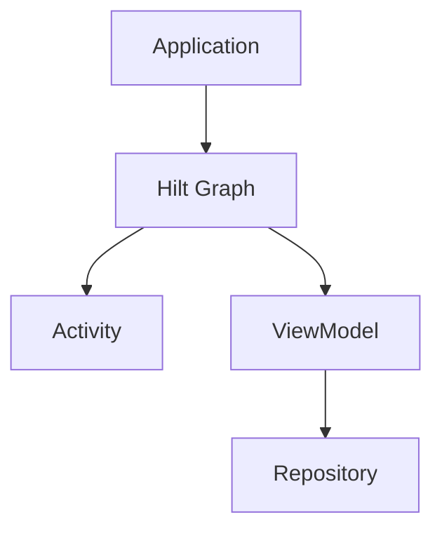

# 03. Application, Activity và ViewModel với Hilt

## Mục tiêu

Sau bài này, bạn sẽ hiểu:

- vai trò của `Application` trong Hilt
- Android entry point là gì
- ViewModel làm việc với Hilt ra sao
- luồng inject cơ bản trong app Android hiện đại

## `Application` là điểm bắt đầu quan trọng

Trong app Android dùng Hilt, `Application` thường là nơi khai báo khởi tạo gốc cho hệ thống DI của app.

Đây là bước nối Hilt vào vòng đời application.

## Android entry point là gì?

Không phải class nào trong Android cũng tự động tham gia vào Hilt. Những nơi framework Android tạo ra và quản lý như activity hoặc fragment cần được đánh dấu đúng để Hilt biết chúng là điểm vào của dependency graph.

Bạn có thể hiểu đơn giản:

- Hilt cần biết class Android nào là nơi nó được phép inject
- nếu không đánh dấu đúng, dependency sẽ không được cung cấp như mong đợi

## ViewModel với Hilt

ViewModel là một chỗ rất quan trọng, vì ở app hiện đại:

- screen state thường nằm ở ViewModel
- ViewModel cần repository hoặc use case
- Compose screen thường lấy state từ ViewModel

Hilt giúp việc tạo ViewModel có dependency trở nên gọn hơn và có cấu trúc hơn.

## Luồng tư duy cơ bản

Ý tưởng là graph Hilt được nối vào app từ đầu, sau đó các thành phần phù hợp có thể nhận dependency từ graph đó.

## Ranh giới trách nhiệm

### Application

- khởi tạo app-level DI integration
- không phải nơi nhét business logic màn hình

### Activity

- là Android host
- trong app Compose thường chỉ là entry container ở mức cao

### ViewModel

- giữ screen state
- nhận dependency như repository, use case
- không nên biết chi tiết render UI

## Compose app thường trông như thế nào?

Trong app Compose hiện đại, activity thường khá mỏng:

- set content
- gắn navigation gốc
- khởi động UI tree

Còn ViewModel mới là nơi nắm screen state và dependency quan trọng.

## Best practices

- Giữ activity mỏng nếu app theo Compose + MVVM.
- Để ViewModel là nơi chính nhận dependency cho screen.
- Hiểu rõ Android entry point nào cần được Hilt quản lý.

## Điều cần tránh

- Activity ôm quá nhiều business logic chỉ vì inject được dependency.
- Không phân biệt `Application`, `Activity` và `ViewModel` về trách nhiệm.
- Coi Hilt như thứ chỉ để “lấy object ra” mà không reason về vòng đời.

## Checklist tự kiểm tra

1. Bạn có hiểu vì sao `Application` quan trọng trong Hilt không?
2. Bạn có hiểu Android entry point là gì không?
3. Bạn có hiểu vì sao ViewModel là vị trí rất hợp để nhận dependency không?

## Bài tiếp theo

Bây giờ bạn cần biết Hilt lấy object từ đâu. Đó là lúc module, `@Provides` và `@Binds` xuất hiện.
