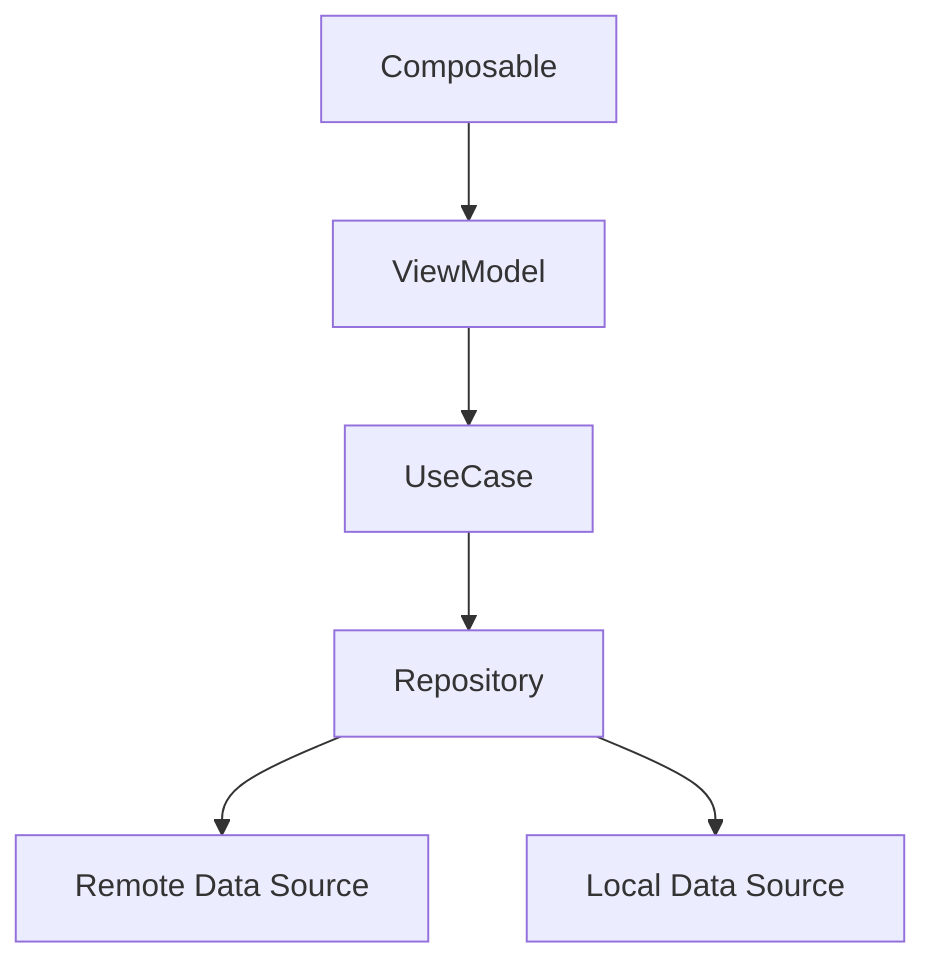

# 06. Inject repository, use case và data source

## Mục tiêu

Sau bài này, bạn sẽ hiểu:

- Hilt thường đi vào kiến trúc app ở những lớp nào
- cách nghĩ về repository, use case và data source trong dependency graph
- vì sao DI giúp các lớp này nối với nhau sạch hơn
- cách tránh biến dependency graph thành một mớ rối

## Một kiến trúc quen thuộc

Trong app Android hiện đại, bạn thường gặp các tầng như:

- UI
- ViewModel
- use case hoặc domain logic
- repository
- data source

Không phải app nào cũng cần đủ mọi tầng. Nhưng khi app đã có repository hoặc use case, Hilt rất hữu ích để nối các lớp đó với nhau.

## Ví dụ luồng phụ thuộc

Ý tưởng chính là mỗi lớp nhận dependency mà nó cần qua constructor hoặc DI graph, thay vì tự new object bên trong.

## Repository

Repository thường là nơi tổng hợp hoặc điều phối dữ liệu từ các nguồn khác nhau.

Ví dụ:

- API
- local database
- cache
- DataStore

Repository rất hợp để được inject, vì nó thường là dependency của ViewModel hoặc use case.

## Use case

Không phải app nào cũng cần use case layer. Nhưng nếu business logic bắt đầu rõ và muốn tách khỏi ViewModel, use case là một lựa chọn tốt.

Use case thường nhận repository làm dependency.

## Data source

Data source thường là những lớp cụ thể hơn, ví dụ:

- remote data source gọi API
- local data source gọi database

Những lớp này cũng có thể được Hilt cung cấp và nối vào repository.

## Lợi ích khi inject theo chuỗi này

- mỗi lớp chỉ biết dependency trực tiếp của nó
- dễ thay implementation hơn
- test từng tầng dễ hơn
- wiring tập trung hơn, không rải rác trong code nghiệp vụ

## Nhưng đừng tạo tầng chỉ để có DI

Một sai lầm phổ biến là:

- thêm use case dù business logic rất nhỏ
- thêm nhiều interface và module chỉ để “trông có kiến trúc”

DI hỗ trợ kiến trúc, không nên ép kiến trúc phình to vô ích.

## Best practices

- Chỉ tạo layer khi nó có ý nghĩa trách nhiệm rõ ràng.
- Dùng DI để nối các layer, không dùng DI để che sự dư thừa kiến trúc.
- Giữ constructor dependency phản ánh đúng trách nhiệm lớp.
- Review các dependency chain quá dài để tránh coupling ẩn.

## Điều cần tránh

- Một lớp nhận quá nhiều dependency mà vẫn coi là bình thường.
- Tạo quá nhiều abstraction không đem lại lợi ích thật.
- Repository hoặc use case tự new tiếp các dependency bên trong.

## Checklist tự kiểm tra

1. Bạn có hiểu repository, use case và data source thường nằm đâu trong graph không?
2. Bạn có hiểu vì sao DI giúp wiring giữa các tầng sạch hơn không?
3. Bạn có nhận ra khi nào một layer là dư thừa không?

## Bài tiếp theo

Sau tầng dữ liệu và nghiệp vụ, bạn sẽ đi vào chỗ rất thực tế với app Compose: `hiltViewModel()` và cách nối Hilt với màn hình Compose.
