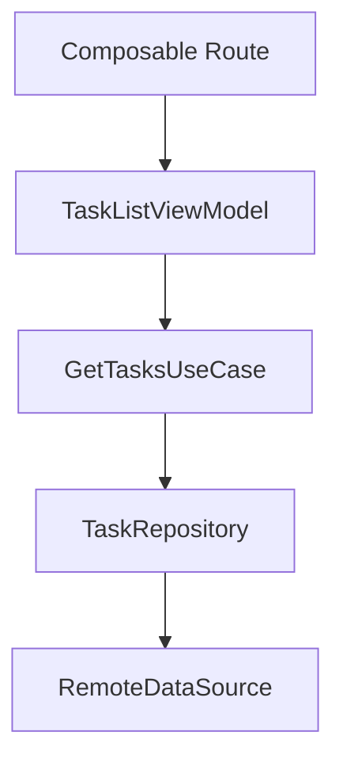

# 10. Ghép Compose + MVVM + Hilt thành một feature hoàn chỉnh

## Mục tiêu

Sau bài này, bạn sẽ nhìn được bức tranh đầy đủ:

- Hilt nằm ở đâu trong app Compose + MVVM
- ViewModel nhận dependency ra sao
- UI nên tách khỏi DI framework như thế nào
- cách tổ chức một feature để vừa sạch vừa dễ mở rộng

## Ví dụ feature: Task List

Giả sử bạn có feature danh sách công việc.

Các thành phần có thể là:

- `TaskListScreen`
- `TaskListViewModel`
- `GetTasksUseCase`
- `TaskRepository`
- `TaskRemoteDataSource`

## Graph phụ thuộc ở mức tư duy

## Vai trò từng phần

### Route composable

- lấy ViewModel bằng `hiltViewModel()`
- collect `uiState`
- nối callback navigation và event

### Screen composable

- nhận `uiState`
- render UI
- phát callback
- không cần biết chi tiết Hilt

### ViewModel

- nhận dependency từ Hilt
- xử lý event
- cập nhật `UiState`

### Repository và data source

- được inject qua graph
- không bị tự new thủ công ở nhiều nơi

## Luồng dữ liệu hoàn chỉnh

1. route lấy `TaskListViewModel`
2. route collect `uiState`
3. `TaskListScreen` render danh sách
4. user click refresh hoặc delete
5. event được gửi lên ViewModel
6. ViewModel gọi use case hoặc repository
7. `uiState` đổi
8. UI recompose

## Vì sao cách này tốt?

- UI tập trung vào render
- ViewModel tập trung vào state và logic màn hình
- dependency wiring nằm ở Hilt
- repository và data source có chỗ đứng rõ ràng
- test từng tầng dễ hơn

## Nơi dễ sai

### 1. Screen tự lấy quá nhiều dependency

Nếu screen composable nào cũng kéo dependency trực tiếp từ graph, kiến trúc sẽ nhanh rối.

### 2. ViewModel nhận quá nhiều dependency

Đây là dấu hiệu cần xem lại use case, repository hoặc trách nhiệm màn hình.

### 3. Không tách route và screen

Bạn vẫn có thể làm app chạy được, nhưng testability và clarity thường kém hơn.

## Mẫu tư duy nên giữ

- Hilt lo wiring dependency
- ViewModel lo screen state
- Compose screen lo render state
- event đi từ UI lên ViewModel
- state đi từ ViewModel xuống UI

## Checklist của một feature sạch

- dependency được inject có chủ đích
- UI không quá phụ thuộc vào framework DI
- `UiState` rõ ràng
- event rõ ràng
- route và screen tách trách nhiệm
- repository hoặc use case không bị new thủ công trong ViewModel

## Tổng kết series Hilt

Nếu bạn học hết series này, bạn nên đủ khả năng:

- hiểu vì sao cần DI
- setup Hilt đúng trong project Android
- inject dependency vào ViewModel và các tầng phù hợp
- dùng Hilt hợp lý với Compose
- tránh các lỗi Hilt phổ biến
- tổ chức feature Compose + MVVM + Hilt theo hướng bền hơn

## Nên làm gì tiếp theo?

1. Tạo một app nhỏ với 1-2 feature dùng Hilt.
2. Tập tách `Route` và `Screen` trong Compose.
3. Tập inject repository thật qua ViewModel.
4. Viết unit test với fake dependency.
5. Khi ổn rồi, mới đi sâu hơn vào multi-module hoặc advanced DI patterns.
