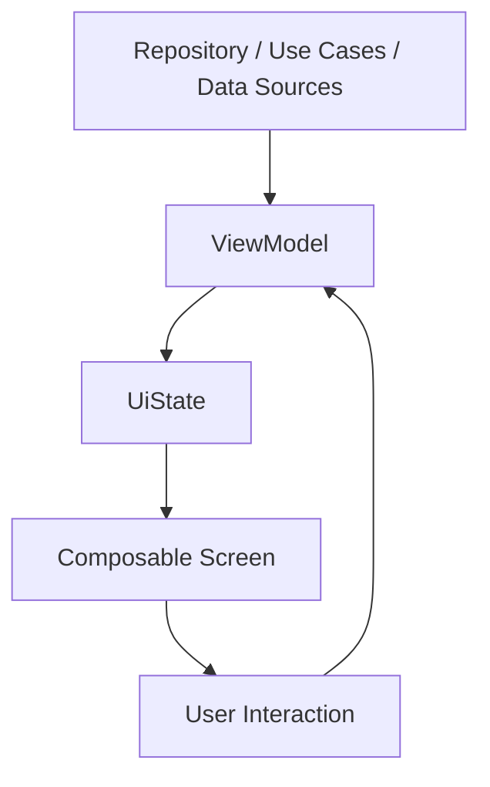

# 01. Compose là gì và Compose đứng ở đâu trong kiến trúc MVVM

## Mục tiêu

Sau bài này, bạn sẽ hiểu:

- Jetpack Compose là gì
- vì sao Compose khác XML UI truyền thống
- Compose giải quyết bài toán nào trong phát triển Android
- Compose nằm ở đâu trong mô hình MVVM
- tư duy declarative UI quan trọng như thế nào

## Vì sao Android cần Jetpack Compose?

Trong mô hình UI truyền thống của Android, bạn thường làm việc với:

- XML để mô tả giao diện
- `findViewById()` hoặc View Binding để lấy view
- nhiều đoạn code cập nhật UI bằng tay

Cách làm này không sai, nhưng dễ nảy sinh các vấn đề:

- UI logic bị phân tán giữa XML và Kotlin
- khi state thay đổi, bạn phải nhớ cập nhật đúng view đúng lúc
- code UI lớn lên nhanh thì khó đọc và khó refactor
- việc tái sử dụng UI không thật sự mượt

Jetpack Compose ra đời để đưa Android sang cách xây UI mới: **declarative UI**.

## Declarative UI là gì?

Declarative UI nghĩa là bạn mô tả:

- UI nên trông như thế nào khi state hiện tại là gì

thay vì mô tả:

- từng bước phải sửa view nào, lúc nào, bằng cách gì

Ví dụ tư duy imperative:

```kotlin
textView.text = "Count: $count"
button.isEnabled = count < 10
```

Ví dụ tư duy declarative:

```kotlin
@Composable
fun CounterScreen(count: Int) {
    Column {
        Text(text = "Count: $count")
        Button(onClick = { /* ... */ }, enabled = count < 10) {
            Text("Increase")
        }
    }
}
```

Ở cách thứ hai, UI là hàm của state. Bạn chỉ cần đưa `count` vào, Compose sẽ lo việc vẽ đúng UI.

## Compose là gì ở mức kỹ thuật?

Jetpack Compose là toolkit UI hiện đại của Android, cho phép bạn xây giao diện hoàn toàn bằng Kotlin.

Nó dựa trên các ý tưởng cốt lõi:

- composable functions
- state-driven rendering
- recomposition
- reusable UI tree
- integration tốt với Kotlin và coroutines

Compose không xóa bỏ hoàn toàn thế giới cũ, nhưng nó là hướng ưu tiên cho Android UI hiện đại, đặc biệt khi bạn bắt đầu dự án mới.

## Compose đứng ở đâu trong MVVM?

Trong MVVM:

- `Model` giữ data và business logic
- `ViewModel` chuẩn bị UI state và xử lý event
- `View` hiển thị state và gửi event lên

Với Compose, phần `View` thường chính là các composable.



Điểm rất quan trọng là:

- Composable không nên ôm business logic
- ViewModel không nên biết chi tiết UI tree
- UI nhận state, render state, và phát event

Đây là lý do Compose rất hợp với MVVM.

## Khái niệm quan trọng: UI là hàm của state

Một trong những câu quan trọng nhất của Compose là:

> UI là hàm của state

Điều đó có nghĩa là nếu state thay đổi, UI nên tự thay đổi theo. Bạn không muốn phải nhớ “bây giờ đổi màu cái nút”, “ẩn cái text”, “đổi icon ở 3 nơi”. Bạn muốn một nguồn sự thật duy nhất là state.

Ví dụ:

```kotlin
data class LoginUiState(
    val email: String = "",
    val password: String = "",
    val isLoading: Boolean = false,
    val errorMessage: String? = null
)
```

Composable đọc `LoginUiState` và quyết định:

- field nào hiển thị gì
- nút có bị disable không
- có hiện loading không
- có hiện lỗi không

## Khi nào Compose đặc biệt phù hợp?

Compose rất mạnh khi bạn làm các ứng dụng có:

- nhiều state UI
- nhiều component tái sử dụng
- cần iteration nhanh về UI
- cần tư duy đồng nhất giữa Kotlin và UI layer
- muốn tích hợp tốt với ViewModel, StateFlow, coroutines

Nó đặc biệt phù hợp với app Android mới dùng MVVM.

## Compose có khó hơn XML không?

Lúc đầu có thể khó hơn ở mặt tư duy, không phải vì cú pháp quá phức tạp. Những thứ người mới thường bị khựng là:

- state nằm ở đâu
- recomposition xảy ra khi nào
- nên dùng `remember` lúc nào
- composable nào nên stateless
- side effect nên đặt ở đâu

Nhưng khi vượt qua giai đoạn đầu, Compose thường giúp bạn phát triển UI nhanh hơn và rõ ràng hơn.

## Ví dụ trực quan hóa

Hãy tưởng tượng bạn có một màn hình hiển thị số lượng item trong giỏ hàng.

Trong tư duy cũ, bạn có thể phải:

1. cập nhật biến count
2. tìm text view
3. set text mới
4. disable nút nếu count = 0

Trong Compose, bạn chỉ cần đưa state vào:

```kotlin
@Composable
fun CartSummary(count: Int) {
    Column {
        Text(text = "Items: $count")
        Button(onClick = { /* checkout */ }, enabled = count > 0) {
            Text("Checkout")
        }
    }
}
```

Khi `count` đổi từ `0` sang `5`, Compose tự render lại phần cần thiết.

## Best practices

- Hãy xem composable như tầng `View` trong MVVM.
- UI nên nhận state càng rõ ràng càng tốt.
- ViewModel nên là nguồn tạo `UiState` chính.
- Tránh để composable tự xử lý business logic phức tạp.
- Tập tư duy “render từ state” ngay từ đầu.

## Điều cần tránh

- Không nhét toàn bộ logic app vào composable.
- Không xem Compose chỉ là “XML nhưng viết bằng Kotlin”.
- Không cập nhật UI theo kiểu imperative nếu không thật sự cần.
- Không để nhiều nguồn sự thật cho cùng một phần UI state.

## Checklist tự kiểm tra

1. Bạn có hiểu sự khác nhau giữa imperative UI và declarative UI không?
2. Bạn có biết Compose nằm ở đâu trong MVVM không?
3. Bạn có hiểu câu “UI là hàm của state” nghĩa là gì không?
4. Bạn có phân biệt được việc nào nên nằm ở ViewModel và việc nào nên nằm ở composable không?

## Bài tiếp theo

Sau khi hiểu Compose đứng ở đâu, bước tiếp theo là biết project phải được cấu hình như thế nào để Compose chạy đúng trong Android app.
