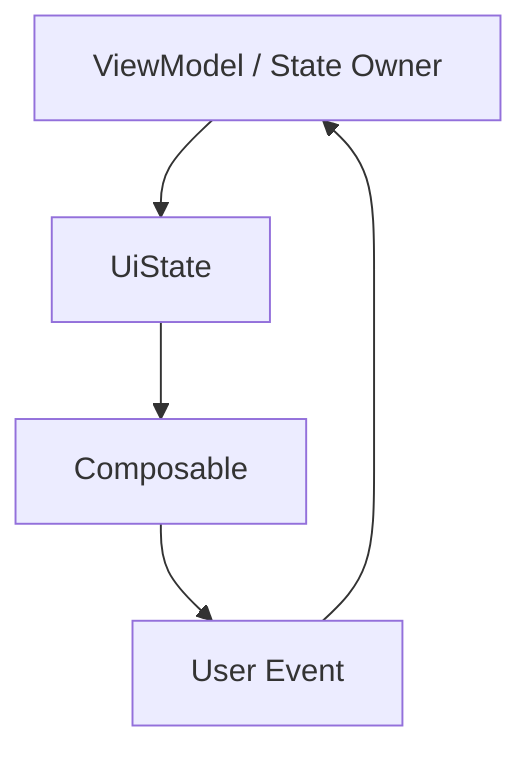

# 13. State hoisting và unidirectional data flow

## Mục tiêu

Sau bài này, bạn sẽ hiểu:

- state hoisting là gì
- unidirectional data flow là gì
- vì sao Compose và MVVM rất hợp với tư duy này
- cách tách composable stateful và stateless

## State hoisting là gì?

State hoisting là kỹ thuật đưa state lên một cấp cao hơn để composable con không tự giữ state đó nữa, mà nhận nó từ bên ngoài cùng với callback để thay đổi state.

Ví dụ thay vì:

```kotlin
@Composable
fun Counter() {
    var count by remember { mutableStateOf(0) }
    // ...
}
```

bạn có thể tách thành:

```kotlin
@Composable
fun Counter(
    count: Int,
    onIncrease: () -> Unit
) {
    Column {
        Text(text = "Count: $count")
        Button(onClick = onIncrease) {
            Text("Increase")
        }
    }
}
```

Lúc này `Counter()` trở thành composable stateless.

## Vì sao state hoisting quan trọng?

Vì nó giúp:

- UI dễ test hơn
- preview dễ hơn
- tái sử dụng dễ hơn
- logic rõ hơn
- state tập trung hơn

Đây là một trong những nguyên tắc quan trọng nhất của Compose.

## Unidirectional Data Flow là gì?

Unidirectional Data Flow, thường viết tắt là UDF, nghĩa là dữ liệu đi theo một chiều rõ ràng:

1. state đi từ trên xuống UI
2. event đi từ UI lên trên
3. tầng quản lý state xử lý event
4. state mới lại đi xuống UI



Đây là mô hình cực hợp với MVVM.

## Stateful vs Stateless composable

### Stateful composable

Composable tự giữ state bên trong.

### Stateless composable

Composable nhận state và callback từ bên ngoài.

Ví dụ phân tách:

```kotlin
@Composable
fun CounterContainer() {
    var count by remember { mutableStateOf(0) }
    Counter(
        count = count,
        onIncrease = { count++ }
    )
}
```

```kotlin
@Composable
fun Counter(count: Int, onIncrease: () -> Unit) {
    Column {
        Text(text = "Count: $count")
        Button(onClick = onIncrease) {
            Text("Increase")
        }
    }
}
```

## Compose + MVVM

Trong app thật, state thường được hoist lên tận ViewModel.

Composable screen nhận:

- `uiState`
- `onEvent(...)`

Ví dụ tư duy:

```kotlin
@Composable
fun TaskScreen(
    uiState: TaskUiState,
    onEvent: (TaskEvent) -> Unit
) {
    // render state
    // phát event
}
```

Đây là mô hình rất bền khi app lớn dần.

## Best practices

- Cố gắng làm component UI tái sử dụng ở dạng stateless nếu hợp lý.
- Đưa state lên nơi phù hợp nhất, không cao quá nếu không cần, không thấp quá nếu gây phân mảnh.
- Giữ dòng dữ liệu một chiều: state xuống, event lên.
- Dùng ViewModel làm state owner cho screen-level state.

## Điều cần tránh

- Mỗi composable tự giữ một phần business state rồi rất khó đồng bộ.
- UI gọi thẳng repository hoặc xử lý logic nghiệp vụ phức tạp.
- Dữ liệu đi vòng vèo nhiều chiều, khó lần luồng cập nhật.

## Checklist tự kiểm tra

1. Bạn có hiểu state hoisting là gì không?
2. Bạn có phân biệt được composable stateful và stateless không?
3. Bạn có hiểu UDF giúp app rõ ràng hơn như thế nào không?
4. Bạn có biết vì sao MVVM rất hợp với Compose không?

## Bài tiếp theo

Sau khi nắm state hoisting, bạn sẽ đi vào chỗ quan trọng nhất của app thật: Compose phối hợp với ViewModel như thế nào.
