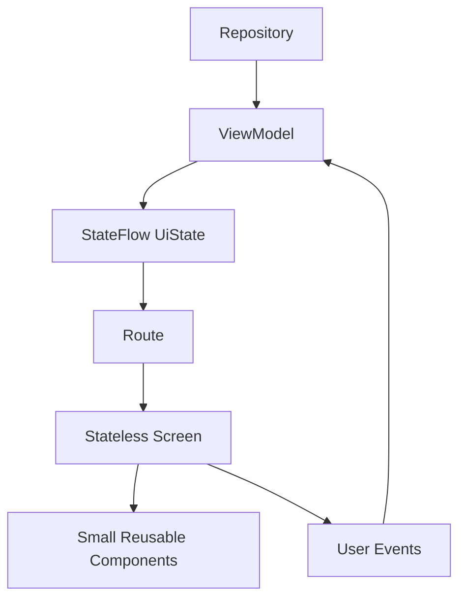

# 25. Ghép một feature Compose + MVVM hoàn chỉnh từ đầu tới cuối

## Mục tiêu

Sau bài này, bạn sẽ nhìn được bức tranh hoàn chỉnh:

- một feature thực tế nên được chia thành những phần nào
- UI, ViewModel, state, event, repository và navigation kết nối ra sao
- đâu là local UI state, đâu là screen state
- cách biến kiến thức rời rạc thành một kiến trúc làm việc được

## Ví dụ feature: Task List

Giả sử bạn xây một feature quản lý công việc đơn giản.

Nó có thể bao gồm:

- màn hình danh sách task
- nút thêm task
- click vào task để xem chi tiết
- xóa task với dialog xác nhận
- snackbar báo kết quả
- loading, empty, error, content state

## Cấu trúc tư duy tổng quát



## Các phần nên có

### 1. `UiState`

Ví dụ:

```kotlin
data class TaskListUiState(
    val isLoading: Boolean = false,
    val tasks: List<TaskItemUi> = emptyList(),
    val errorMessage: String? = null
)
```

Đây là nguồn dữ liệu để screen render.

### 2. `Event`

Ví dụ:

```kotlin
sealed class TaskListEvent {
    data object Refresh : TaskListEvent()
    data class DeleteTask(val id: Long) : TaskListEvent()
    data class OpenTask(val id: Long) : TaskListEvent()
}
```

Điều này giúp tương tác có cấu trúc rõ ràng.

### 3. `ViewModel`

ViewModel:

- nhận event
- gọi repository
- cập nhật `UiState`
- phát dữ liệu cho UI

### 4. `Route`

`Route` làm nhiệm vụ:

- lấy ViewModel
- collect `uiState`
- nối callback navigation
- điều phối screen-level wiring

### 5. `Screen`

`Screen` nhận:

- `uiState`
- callback event
- callback navigation cấp màn hình nếu cần

`Screen` nên càng thuần càng tốt.

### 6. Component con

Ví dụ:

- `TaskRow`
- `EmptyState`
- `ErrorState`
- `TaskTopBar`

Những component này nên nhỏ, rõ trách nhiệm và có thể stateless.

## Luồng hoạt động ví dụ

### Khi mở màn hình

1. `Route` collect `uiState` từ ViewModel
2. `Screen` render loading hoặc content
3. nếu cần, effect kích hoạt load ban đầu hoặc ViewModel tự load từ đầu

### Khi user bấm xóa task

1. `TaskRow` phát `onDeleteClick(task.id)`
2. `Screen` bật dialog xác nhận cục bộ
3. user xác nhận
4. `Screen` gửi event `DeleteTask(id)` lên ViewModel
5. ViewModel gọi repository xóa
6. `uiState` cập nhật lại danh sách
7. UI recompose
8. snackbar có thể được show như một one-time feedback

### Khi user bấm vào task

1. UI phát `onOpenTask(id)`
2. route hoặc nav layer điều hướng tới detail screen

## Nơi đặt state

### Local UI state

Ví dụ:

- dialog đang mở hay không
- query tạm trong ô search đơn giản
- trạng thái expand nhỏ

### Screen state

Ví dụ:

- loading
- list dữ liệu
- lỗi tải dữ liệu
- filter đang áp dụng cho cả màn hình

### Business state

Ví dụ:

- dữ liệu lấy từ repository
- kết quả đồng bộ backend
- logic nghiệp vụ xóa hoặc cập nhật task

## Checklist kiến trúc feature tốt

- UI render từ `UiState`
- event đi ngược lên ViewModel
- ViewModel là state owner cho màn hình
- component con nhỏ, rõ trách nhiệm
- navigation nằm ở tầng route hoặc screen
- local UI state không bị lẫn với business state

## Sai lầm thường gặp

- screen vừa render vừa gọi repository
- ViewModel không có `UiState` rõ ràng
- item composable ôm logic nghiệp vụ
- navigation nằm rải khắp nơi
- event không có cấu trúc, callback chằng chịt

## Sau series này bạn nên làm gì?

1. Tự dựng một app nhỏ bằng Compose + MVVM.
2. Tạo ít nhất một feature có loading, empty, error, content state.
3. Thêm navigation list -> detail.
4. Thêm form nhập liệu và state hoisting.
5. Viết test cho một screen stateless.
6. Sau đó học tiếp series Hilt để nối dependency injection vào cấu trúc này.

## Tổng kết

Nếu bạn đã đi hết series Compose này, bạn đã có:

- nền tảng tư duy declarative UI
- hiểu state, recomposition, hoisting
- hiểu Compose gắn với ViewModel, StateFlow, lifecycle
- biết cách tổ chức screen, component, navigation và side effects
- đủ nền để bắt đầu viết app Android hiện đại một cách có cấu trúc

Series tiếp theo hợp lý nhất là Hilt, để bạn quản lý dependency cho ViewModel, repository và các tầng khác một cách sạch hơn.
